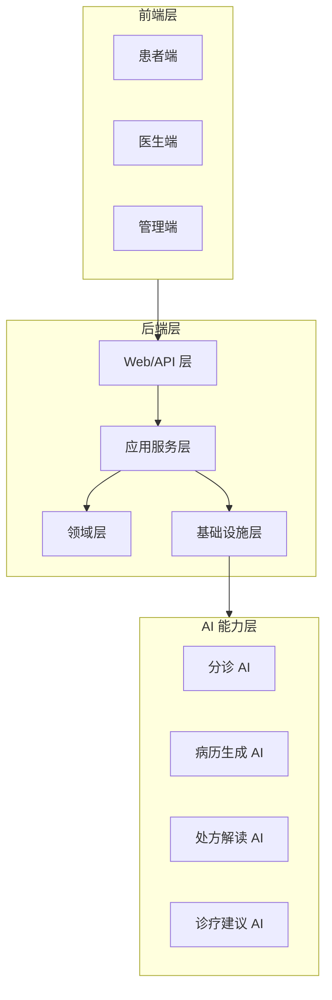

# 东软智慧云脑诊疗平台 技术设计 v1

**依据**：`requirement.md`、`docs/系统设计文档-东软智慧云脑诊疗平台.md`（v3.0）  
**设计边界**：仅覆盖技术方案与决策，不包含实现代码。

## 1. 设计目标

1. 与 v3.0 口径完全对齐，统一 `RegistrationStatus` 闭环状态机。
2. 明确 E03 双视角看板的读模型契约，区分医生端与管理端。
3. 明确 E09 四类 AI 微服务的内部接口矩阵与降级策略。
4. 严格分离 `AIConfig`、`SecretCipher`、`AIProviderResolver`、`AICallRecord` 的职责。
5. 给出可落地的分层架构、模块边界、领域对象、API、数据库、并发、安全、部署与前端 Store 契约。

## 2. 总体架构

系统采用“前端应用 + 模块化单体后端 + AI 任务端口/适配器”的基线架构，E09 预留为可拆分微服务边界。

### 2.1 分层原则

- **Web/API 层**：参数校验、鉴权入口、统一响应、异常映射。
- **应用服务层**：用例编排、事务边界、状态推进、跨模块协调。
- **领域层**：挂号状态机、处方审核规则、AI 配置聚合、审计记录模型。
- **基础设施层**：Repository、加密器、AI 供应商解析、外部 AI 适配器、消息/通知适配器。

### 2.2 基线形态

- P0 采用模块化单体，保证本地联调与教学演示闭环。
- E09 通过任务端口抽象隔离，不把远程 AI 细节扩散到业务层。
- E03 看板采用读侧聚合，不反向耦合写事务。
- 前端三端共用同一后端 API，但以角色与 `ActorContext` 做访问隔离。

## 3. 模块边界

### 3.1 核心业务模块

1. **挂号与分诊模块**
   - 负责症状分诊、挂号创建、取消、候选科室/医生推荐。
   - 核心对象：`Registration`、`TriageRecord`、`RegistrationStatus`。
2. **就诊与病历模块**
   - 负责接诊、问诊记录、病历保存、病历草稿流转。
   - 核心对象：`MedicalRecord`。
3. **处方与审核模块**
   - 负责处方草拟、规则审核、人工确认、提交与闭环。
   - 核心对象：`Prescription`、`PrescriptionReview`、`PrescriptionRuleDefinition`、`RuleBasis`、`RuleHit`。
4. **基础数据与管理模块**
   - 负责科室、医生、药品、排班、规则、AI 配置、审计看板。
5. **认证与通用模块**
   - 负责 JWT、`ActorContext`、`RolePolicy`、统一响应与异常处理。

### 3.2 扩展能力模块

1. **E01 AI 诊疗建议**：基于问诊上下文输出诊断建议与检查项。
2. **E02 就诊评价与分诊反馈**：评价写回与分诊准确度统计。
3. **E03 数据看板**：医生端/管理端双视角读模型。
4. **E04 WebSocket 告警**：高风险用药推送与通知记录。
5. **E05 SSE 流式输出**：病历草稿和诊疗建议的流式交互。
6. **E06 Pinia 状态机**：前端状态分层与约束。
7. **E07 Prompt 模板**：版本化模板与变量渲染。
8. **E08 Nginx + Jar 部署**：双端与后端分离部署。
9. **E09 四类 AI 微服务**：triage / diagnosis / prescription-review / medical-record。
10. **E10 HIS 防腐层**：远期边界预留，不进入 P0 主链路。

## 4. 领域模型

### 4.1 挂号闭环状态机

`RegistrationStatus` 是全系统挂号闭环的权威状态，任何模块不得绕开该状态机判断业务可用性。

状态流转：

- `WAITING`
- `IN_CONSULTATION`
- `MEDICAL_RECORD_SAVED`
- `PRESCRIPTION_REVIEWED`
- `PRESCRIPTION_SUBMITTED`
- `COMPLETED`
- `CANCELLED`

关键约束：

- “保存病历”不等于“就诊完成”。
- `PRESCRIPTION_SUBMITTED` 保留为提交终态前置状态。
- 就诊完成只能由处方提交后的闭环动作或医生结束就诊触发。
- `CANCELLED` 为终态，不能回流。

### 4.2 关键领域对象

- `Registration`：挂号聚合根，承载当前状态、版本号、患者、医生、排班、时间片信息。
- `TriageRecord`：分诊业务记录，保存患者看到的推荐结果与追溯信息。
- `MedicalRecord`：病历聚合，承载问诊、主诉、诊断方向、草稿与确认态。
- `Prescription`：处方聚合，承载药品明细、风险级别、提交信息。
- `PrescriptionReview`：处方审核聚合，承载规则命中、人工确认、LLM 解读快照。
- `PrescriptionRuleDefinition`：可配置规则定义，版本化保存。
- `RuleBasis`：规则依据值对象，描述规则类型、等级、来源、解释。
- `RuleHit`：规则命中值对象，保存命中详情与证据快照。
- `AIConfig`：AI 配置聚合，保存供应商、任务类型、启用状态、加密密钥引用、版本。
- `AICallRecord`：AI 调用审计记录，保存技术调用事实，不承载业务状态本体。

### 4.3 AI 职责分离

- `AIConfig` 只负责“可配、可审、可降级”的配置事实。
- `SecretCipher` 只负责敏感值加解密与掩码辅助。
- `AIProviderResolver` 只负责按任务类型、启用状态、健康状态选择供应商。
- `AICallRecord` 只负责记录调用链路、耗时、降级、错误与摘要。

## 5. API 契约

### 5.1 统一响应

所有公开 API 统一返回 `Result<T>` 风格响应，包含：

- `code`
- `message`
- `data`
- `timestamp`

### 5.2 API 分组

#### 患者端

- 分诊推荐
- 挂号创建/取消
- 个人病历/处方查看
- 就诊评价提交

#### 医生端

- 工作台首页
- 接诊与病历编辑
- 处方草拟、审核、提交
- 看板查询

#### 管理端

- 科室、医生、排班、药品、规则管理
- AI 配置管理
- 看板与审计追踪

### 5.3 E03 双视角看板契约

看板采用“同一套后端读模型，不同角色不同投影字段”的方案。

#### 医生端视角

关注个人工作负载与诊疗效率：

- 今日接诊量
- 待处理挂号
- 处方审核通过率
- 风险处方数量
- AI 辅助使用情况

#### 管理端视角

关注全局运营与配置效果：

- 科室/医生维度统计
- AI 使用率与成功率
- 风险分布
- 趋势变化
- 配置与审计摘要

#### 读模型约束

- 读模型只读，不驱动写状态。
- 不通过实时写事务维护复杂统计。
- 统计可来自基础表查询、聚合视图或缓存投影，但必须保持与主业务表一致口径。

### 5.4 E09 内部接口矩阵

内部接口仅供核心服务调用，不对前端暴露。

| 服务 | 内部路径 | 责任 |
|---|---|---|
| `triage-ai-service` | `POST /internal/ai/v1/triage/recommend` | 分诊推荐 |
| `diagnosis-ai-service` | `POST /internal/ai/v1/diagnosis/suggest` | 诊疗建议 |
| `prescription-review-ai-service` | `POST /internal/ai/v1/prescription-review/explain` | 处方解读 |
| `medical-record-ai-service` | `POST /internal/ai/v1/medical-record/generate` | 病历生成 |

统一契约要求：

- 必带 `traceId`
- 必带内部鉴权信息
- 返回降级状态
- 返回模型摘要与可审计元数据
- 不携带前端 JWT 透传

## 6. 数据库设计

### 6.1 核心表族

1. `registration`
   - 主键、患者、医生、排班、状态、版本号、取消原因、完成时间。
2. `triage_record`
   - 挂号关联、症状摘要、推荐科室、推荐医生、推荐理由、降级状态。
3. `medical_record`
   - 挂号关联、问诊文本、诊断方向、病历草稿、最终病历、确认状态。
4. `prescription`
   - 挂号关联、药品快照、风险等级、提交状态、提交时间。
5. `prescription_review`
   - 处方关联、规则命中、人工确认、LLM 解读快照、审核版本。
6. `prescription_rule_definition`
   - 规则内容、版本、启用状态、适用范围、编译状态。
7. `ai_config`
   - 任务类型、供应商、密钥引用、启用状态、健康状态、版本、更新时间。
8. `ai_call_record`
   - 任务类型、供应商、请求摘要、响应摘要、耗时、降级状态、错误码、traceId。

### 6.2 关系原则

- 业务表与审计表分离。
- AI 调用记录与业务事实分离。
- 规则定义与规则命中分离。
- 看板不引入独立强一致大宽表作为唯一事实源。

### 6.3 约束与索引

- `registration` 以 `(patient_id, schedule_id)` 做唯一约束，防止重复挂号。
- `registration.version`、`prescription_review.version`、`ai_config.version` 用于乐观锁。
- `ai_call_record.trace_id`、`request_id` 建议建立检索索引。
- `ai_config` 按 `task_type + enabled + priority` 建立查询索引。

## 7. 并发与一致性

### 7.1 状态推进

- `Registration`、`PrescriptionReview`、`AIConfig` 的更新采用乐观锁。
- 所有状态迁移只能通过领域策略完成。
- 前端重复点击、重放请求、页面刷新后重复提交，后端必须幂等处理。

### 7.2 幂等策略

- 挂号创建、取消、病历保存、处方提交、评价提交均应具备幂等键。
- 重复提交返回既有结果或明确冲突，不产生重复副作用。

### 7.3 AI 调用并发

- AI 调用采用超时控制与有限重试。
- 重试只适用于网络中断、超时和可恢复 5xx。
- 4xx、鉴权失败、参数错误不重试。
- 远程 AI 失败时写入 `AICallRecord`，并返回降级结果。

## 8. 错误处理

### 8.1 统一异常分层

- **校验错误**：400
- **鉴权错误**：401 / 403
- **状态冲突**：409
- **资源不存在**：404
- **系统错误**：500

### 8.2 AI 降级状态

AI 调用的业务输出必须携带降级语义，典型状态：

- `AI_DISABLED`
- `AI_TIMEOUT`
- `REMOTE_AI_UNAVAILABLE`
- `AI_PARSE_FAILED`

### 8.3 业务错误原则

- 规则校验失败不得伪装为低风险结果。
- 状态机非法迁移必须显式报错。
- 看板空数据应返回空结构，不应返回错误。

## 9. 安全设计

### 9.1 认证与授权

- 采用 JWT 认证。
- 采用 RBAC 角色控制，角色至少包含患者、医生、管理员。
- 业务判断统一依赖 `ActorContext`，不信任前端直传身份字段。

### 9.2 敏感数据

- AI API Key、内部凭据等敏感值必须加密存储。
- `SecretCipher` 负责密钥加解密，不参与业务决策。
- 日志不得记录明文密钥、完整 prompt、JWT、患者敏感原文。

### 9.3 E09 内部鉴权

- AI 微服务仅接受内部请求。
- 使用服务间凭据，不透传用户 JWT。
- 内部鉴权失败按降级处理，不暴露实现细节给前端。

### 9.4 前端安全边界

- 前端不接触 API Key。
- 前端仅持有登录态与业务数据。
- 401 统一跳转登录，403 提示无权限。

## 10. 部署设计

### 10.1 基线部署

- 前端静态资源由 Nginx 托管。
- 后端以单 Jar 运行。
- 数据库独立部署。

### 10.2 扩展部署

- E09 四类 AI 服务可独立部署。
- 核心业务服务保留本地适配器或远程适配器切换能力。
- `AIConfig` 改动与服务重启策略应解耦，但配置生效边界必须明确。

### 10.3 部署边界

- P0 主链路不依赖 WebSocket、SSE、看板、HIS 或真实外部 AI 的实时可用性。
- AI 与 HIS 均属于可降级外部依赖。

## 11. 前端 Store 契约

### 11.1 Store 划分

- `useAuthStore`
- `usePatientStore`
- `useDoctorStore`
- `useAdminStore`
- `useRegistrationStore`
- `useScheduleStore`
- `useDrugStore`
- `usePrescriptionStore`
- `useMedicalRecordStore`
- `useAIStore`
- `useDashboardStore`
- `useNotificationStore`

### 11.2 Store 规范

每个 Store 至少具备：

- `loading`
- `error`
- `degraded`
- `lastLoadedAt`

约束：

- Store 只保存交互状态与后端 VO 缓存。
- Store 不承担权威业务状态推进。
- 关键枚举必须来自后端类型契约。
- 不允许用松散字符串代替状态枚举。

### 11.3 视图协作

- 患者端 Store 偏向查询与流程推进。
- 医生端 Store 偏向工作台、病历、处方、告警。
- 管理端 Store 偏向配置、看板、审计、基础数据。

## 12. 关键设计决策

1. 采用模块化单体作为首版主形态，确保 P0 闭环可运行。
2. `RegistrationStatus` 采用闭环状态机，消除“保存病历即完成挂号”的歧义。
3. E03 采用医生端/管理端双视角读模型，不共享写模型语义。
4. E09 拆为四类 AI 微服务，核心服务保留内部端口隔离。
5. `AIConfig`、`SecretCipher`、`AIProviderResolver`、`AICallRecord` 四者职责强分离。
6. AI 调用必须可审计、可降级、可重放分析。
7. 前端 Store 只维护交互状态，不允许覆盖服务端权威状态。

## 13. 结论

本设计以 v3.0 为唯一口径，完成了核心状态机、看板双视角、四类 AI 微服务、配置与审计分离、数据库与并发、安全、部署及前端 Store 契约的统一定义，可作为后续实现与联调的技术依据。

