# 东软智慧云脑诊疗平台 — 系统设计文档

---

**版本**：v2.0
**日期**：2026-06-14
**关联文档**：[PRD v1.2](./PRD-东软智慧云脑诊疗平台.md) | [需求.md](../docxs/需求.md)

**v2.0 变更说明**：

- 修复全部 22 张 Mermaid 图渲染问题：纯 ASCII 节点 ID、双引号包裹文本、移除实验性语法、移除孤立节点
- 新增第 6 模块覆盖 P1 进阶能力（AI 诊疗建议、就诊评价、数据看板、SSE、状态机、Prompt 模板）
- 补充 F10-F11 医生列表/详情公开 API 至模块一
- ER 图移除未定义的 AuditLog，所有实体完整定义

---

## 目录

- [1. 系统概述](#1-系统概述)
- [2. 系统架构设计](#2-系统架构设计)
  - [2.1 系统上下文架构](#21-系统上下文架构)
  - [2.2 技术架构全景](#22-技术架构全景)
  - [2.3 前端架构设计](#23-前端架构设计)
  - [2.4 后端分层架构](#24-后端分层架构)
  - [2.5 项目源码结构](#25-项目源码结构)
- [3. 功能模块分解](#3-功能模块分解)
  - [3.1 模块总览](#31-模块总览)
  - [3.2 模块职责矩阵](#32-模块职责矩阵)
  - [3.3 模块依赖关系](#33-模块依赖关系)
- [4. 数据库设计](#4-数据库设计)
  - [4.1 实体关系总览 ER 图](#41-实体关系总览-er-图)
  - [4.2 核心表结构设计](#42-核心表结构设计)
- [5. 核心模块详细设计](#5-核心模块详细设计)
  - [5.1 模块一：智能分诊与挂号模块](#51-模块一智能分诊与挂号模块)
  - [5.2 模块二：AI 病历生成模块](#52-模块二ai-病历生成模块)
  - [5.3 模块三：处方审核与开具模块](#53-模块三处方审核与开具模块)
  - [5.4 模块四：管理端基础数据模块](#54-模块四管理端基础数据模块)
  - [5.5 模块五：用户认证与通用基础设施模块](#55-模块五用户认证与通用基础设施模块)
  - [5.6 模块六：P1 进阶能力模块](#56-模块六p1-进阶能力模块)
- [6. API 接口总览](#6-api-接口总览)
- [7. AI 服务集成设计](#7-ai-服务集成设计)
- [8. 安全设计](#8-安全设计)

---

## 1. 系统概述

东软智慧云脑诊疗平台是一套基于 Spring Boot 3 + Vue 3 前后端分离架构的**三端智能门诊诊疗原型系统**，面向高校软件工程实训课程。系统覆盖患者端（手机窗口式）、医生端（PC 工作台）、管理端（PC 后台），融合 AI 大模型与本地处方规则引擎，实现"诊前分诊 → 线上挂号 → 医生接诊 → 病历生成 → 处方审核 → 患者查看"的一期诊疗闭环。

**设计目标**：

- 前后端分离，RESTful API + JWT 认证
- 后端 Controller-Service-Repository 三层分层
- AI 能力封装为独立 Service，支持多供应商切换
- 处方审核采用"本地规则优先 + 大模型解释"架构
- 三端共享同一后端 API，通过角色鉴权区分权限
- P0 核心模块 5 个 + P1 进阶模块 1 个，共 6 个功能模块

---

## 2. 系统架构设计

### 2.1 系统上下文架构

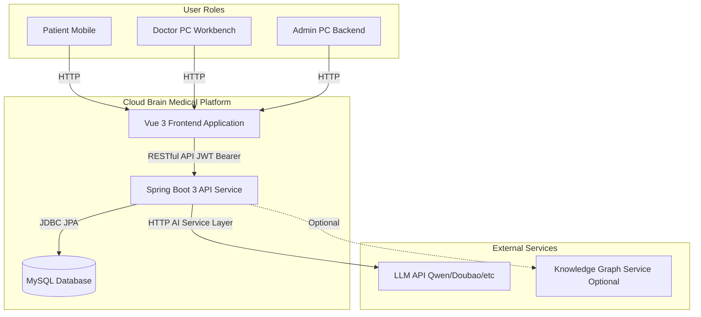
```mermaid
flowchart TB
    subgraph Users["User Roles"]
        N_Patient["Patient Mobile"]
        N_Doctor["Doctor PC Workbench"]
        N_Admin["Admin PC Backend"]
    end

    subgraph System["Cloud Brain Medical Platform"]
        N_WebApp["Vue 3 Frontend Application"]
        N_API["Spring Boot 3 API Service"]
        N_DB[("MySQL Database")]
    end

    subgraph External["External Services"]
        N_LLM["LLM API Qwen/Doubao/etc"]
        N_KG["Knowledge Graph Service Optional"]
    end

    N_Patient -->|"HTTP"| N_WebApp
    N_Doctor -->|"HTTP"| N_WebApp
    N_Admin -->|"HTTP"| N_WebApp
    N_WebApp -->|"RESTful API JWT Bearer"| N_API
    N_API -->|"JDBC JPA"| N_DB
    N_API -->|"HTTP AI Service Layer"| N_LLM
    N_API -.->|"Optional"| N_KG
```

### 2.2 技术架构全景

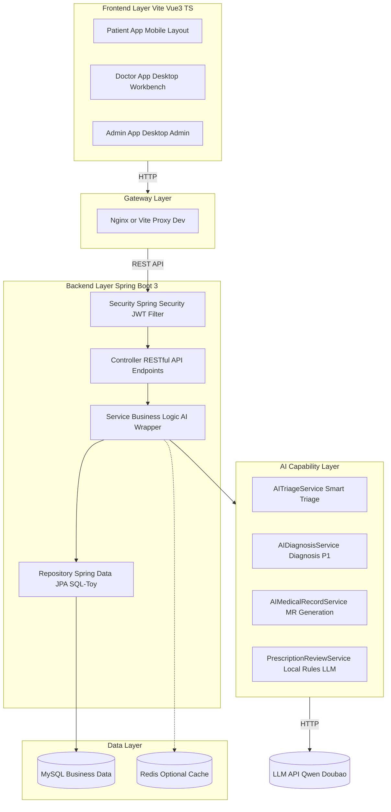
```mermaid
flowchart TB
    subgraph Frontend["Frontend Layer Vite Vue3 TS"]
        N_PApp["Patient App Mobile Layout"]
        N_DApp["Doctor App Desktop Workbench"]
        N_AApp["Admin App Desktop Admin"]
    end

    subgraph Gateway["Gateway Layer"]
        N_Proxy["Nginx or Vite Proxy Dev"]
    end

    subgraph Backend["Backend Layer Spring Boot 3"]
        N_Sec["Security Spring Security JWT Filter"]
        N_Ctrl["Controller RESTful API Endpoints"]
        N_Svc["Service Business Logic AI Wrapper"]
        N_Repo["Repository Spring Data JPA SQL-Toy"]
    end

    subgraph AI["AI Capability Layer"]
        N_AITriage["AITriageService Smart Triage"]
        N_AIDiag["AIDiagnosisService Diagnosis P1"]
        N_AIMR["AIMedicalRecordService MR Generation"]
        N_AIReview["PrescriptionReviewService Local Rules LLM"]
    end

    subgraph Data["Data Layer"]
        N_MySQL[("MySQL Business Data")]
        N_Redis[("Redis Optional Cache")]
    end

    Frontend -->|"HTTP"| Gateway
    Gateway -->|"REST API"| N_Sec
    N_Sec --> N_Ctrl
    N_Ctrl --> N_Svc
    N_Svc --> AI
    N_Svc --> N_Repo
    N_Repo --> N_MySQL
    AI -->|"HTTP"| N_LLM_EXT[("LLM API Qwen Doubao")]
    N_Svc -.-> N_Redis
```

### 2.3 前端架构设计

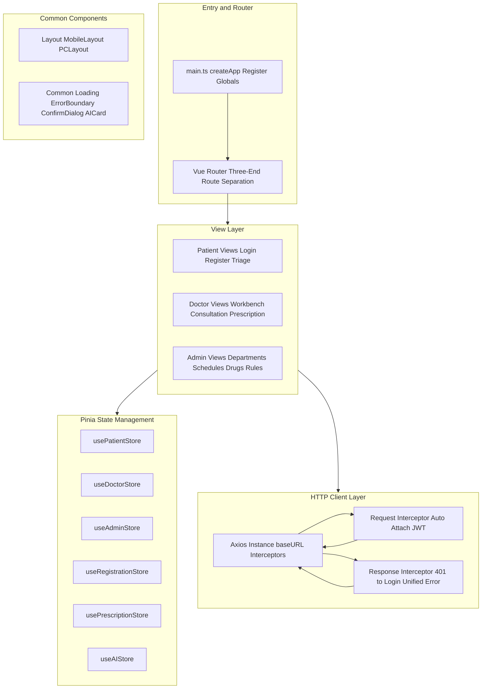
```mermaid
flowchart TB
    subgraph Entry["Entry and Router"]
        N_Main["main.ts createApp Register Globals"]
        N_Router["Vue Router Three-End Route Separation"]
    end

    subgraph Stores["Pinia State Management"]
        N_PatStore["usePatientStore"]
        N_DocStore["useDoctorStore"]
        N_AdmStore["useAdminStore"]
        N_RegStore["useRegistrationStore"]
        N_PresStore["usePrescriptionStore"]
        N_AIStore["useAIStore"]
    end

    subgraph API["HTTP Client Layer"]
        N_Axios["Axios Instance baseURL Interceptors"]
        N_ReqInt["Request Interceptor Auto Attach JWT"]
        N_RespInt["Response Interceptor 401 to Login Unified Error"]
    end

    subgraph Views["View Layer"]
        N_PatViews["Patient Views Login Register Triage"]
        N_DocViews["Doctor Views Workbench Consultation Prescription"]
        N_AdmViews["Admin Views Departments Schedules Drugs Rules"]
    end

    subgraph Components["Common Components"]
        N_Layout["Layout MobileLayout PCLayout"]
        N_Common["Common Loading ErrorBoundary ConfirmDialog AICard"]
    end

    N_Main --> N_Router
    N_Router --> Views
    Views --> Stores
    Views --> API
    N_Axios --> N_ReqInt
    N_Axios --> N_RespInt
    N_ReqInt --> N_Axios
    N_RespInt --> N_Axios
```

三端路由设计：

| 端     | 路由前缀      | 示例                                                                              |
| ------ | ------------- | --------------------------------------------------------------------------------- |
| 患者端 | `/patient/` | `/patient/login`、`/patient/triage`、`/patient/registrations`               |
| 医生端 | `/doctor/`  | `/doctor/workbench`、`/doctor/consultation/:id`、`/doctor/prescription/:id` |
| 管理端 | `/admin/`   | `/admin/departments`、`/admin/schedules`、`/admin/drugs`                    |

### 2.4 后端分层架构

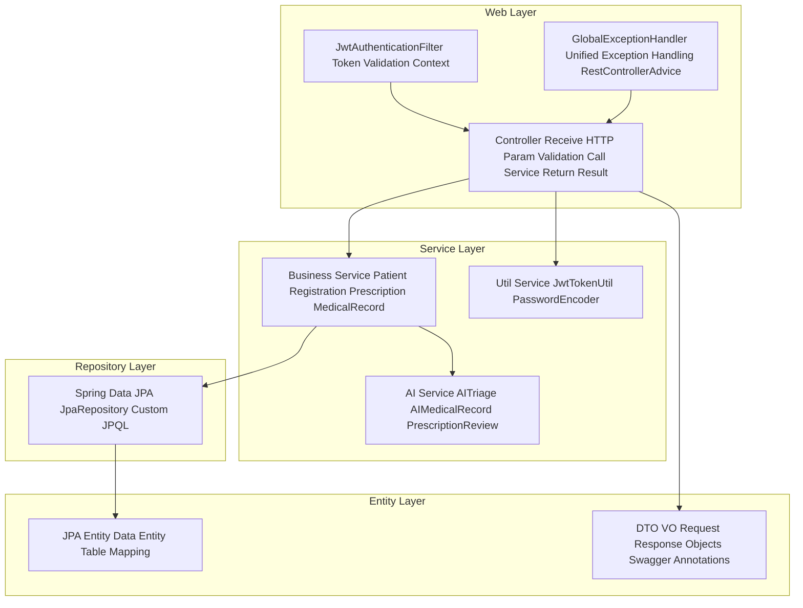
```mermaid
flowchart TB
    subgraph WebLayer["Web Layer"]
        N_Filter["JwtAuthenticationFilter Token Validation Context"]
        N_Controller["Controller Receive HTTP Param Validation Call Service Return Result"]
        N_Advice["GlobalExceptionHandler Unified Exception Handling RestControllerAdvice"]
    end

    subgraph ServiceLayer["Service Layer"]
        N_BizSvc["Business Service Patient Registration Prescription MedicalRecord"]
        N_AISvc["AI Service AITriage AIMedicalRecord PrescriptionReview"]
        N_UtilSvc["Util Service JwtTokenUtil PasswordEncoder"]
    end

    subgraph RepoLayer["Repository Layer"]
        N_JPA["Spring Data JPA JpaRepository Custom JPQL"]
    end

    subgraph EntityLayer["Entity Layer"]
        N_Entity["JPA Entity Data Entity Table Mapping"]
        N_DTO["DTO VO Request Response Objects Swagger Annotations"]
    end

    N_Filter --> N_Controller
    N_Controller --> N_BizSvc
    N_Controller --> N_UtilSvc
    N_BizSvc --> N_AISvc
    N_BizSvc --> N_JPA
    N_JPA --> N_Entity
    N_Controller --> N_DTO
    N_Advice --> N_Controller
```

统一响应结构 `Result`（泛型 `<T>`）：

```java
public class Result<T> {
    private int code;        // 200 success, 4xx client error, 5xx server error
    private String message;
    private T data;
    private long timestamp;
}
```

### 2.5 项目源码结构

```
cloud-brain-medical/
├── backend/
│   ├── pom.xml
│   └── src/main/java/com/cloudbrain/
│       ├── config/                   # SecurityConfig CorsConfig Knife4jConfig AIConfig
│       ├── security/                 # JwtTokenUtil JwtAuthenticationFilter
│       ├── common/                   # Result GlobalExceptionHandler BaseEntity
│       ├── controller/
│       │   ├── patient/              # Patient public controllers
│       │   ├── doctor/               # Doctor controllers
│       │   └── admin/                # Admin controllers
│       ├── service/
│       │   ├── business/             # Business services
│       │   └── ai/                   # AI capability services
│       ├── repository/               # JPA repositories
│       ├── entity/                   # JPA entities
│       ├── dto/                      # Request/Response DTOs
│       └── enums/                    # Enumerations
├── frontend/
│   ├── package.json
│   ├── vite.config.ts
│   └── src/
│       ├── api/                      # Axios API wrappers
│       ├── router/                   # Vue Router config
│       ├── stores/                   # Pinia stores
│       ├── views/
│       │   ├── patient/              # Patient pages
│       │   ├── doctor/               # Doctor pages
│       │   └── admin/                # Admin pages
│       ├── components/               # Shared components
│       └── utils/                    # Utilities
└── docs/                             # Project documentation
```

---

## 3. 功能模块分解

### 3.1 模块总览

本系统划分为 **6 个功能模块**。其中模块一至五对应 P0 核心交付，模块六覆盖 P1 进阶能力。

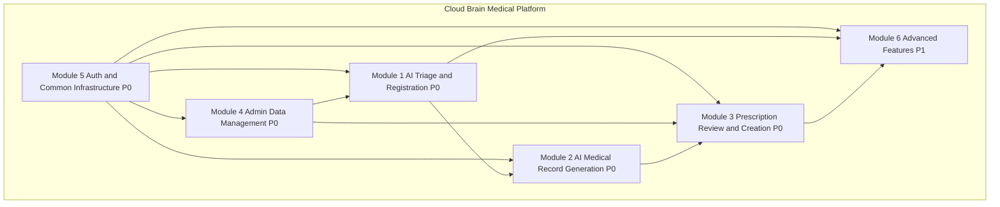
```mermaid
flowchart TB
    subgraph Platform["Cloud Brain Medical Platform"]
        M1["Module 1 AI Triage and Registration P0"]
        M2["Module 2 AI Medical Record Generation P0"]
        M3["Module 3 Prescription Review and Creation P0"]
        M4["Module 4 Admin Data Management P0"]
        M5["Module 5 Auth and Common Infrastructure P0"]
        M6["Module 6 Advanced Features P1"]
    end

    M5 --> M1
    M5 --> M2
    M5 --> M3
    M5 --> M4
    M5 --> M6
    M4 --> M1
    M4 --> M3
    M1 --> M2
    M2 --> M3
    M1 --> M6
    M3 --> M6
```

### 3.2 模块职责矩阵

| 模块                                 | 负责人   | 主要职责                                                                         | 包含 PRD 功能编号 | P0 接口 |
| ------------------------------------ | -------- | -------------------------------------------------------------------------------- | ----------------- | ------- |
| **模块一：智能分诊与挂号**     | 成员 A   | AI 分诊、公开科室/医生查询、排班号源查询、挂号与取消                             | F10-F19, F22      | 10 个   |
| **模块二：AI 病历生成**        | 成员 B   | 问诊录入、AI 病历生成、病历编辑保存、病历列表查询                                | F31-F35           | 6 个    |
| **模块三：处方审核与开具**     | 成员 C   | 处方开具、本地规则+大模型处方审核、审核记录、处方列表                            | F23, F25-F30      | 7 个    |
| **模块四：管理端基础数据**     | 成员 D   | 科室/医生管理、排班号源、药品库 CRUD、处方规则 CRUD、AI 配置                     | F20-F24           | 18 个   |
| **模块五：认证与通用基础设施** | 成员 E   | JWT 认证、三端登录注册、统一响应结构、全局异常、CORS、Swagger、联调配置          | F01-F09, F36-F39  | 8 个    |
| **模块六：P1 进阶能力**        | 先完成者 | AI 诊疗建议、就诊评价与反馈、数据可视化看板、SSE 流式、Pinia 状态机、Prompt 模板 | E01-E06           | 8 个    |

### 3.3 模块依赖关系

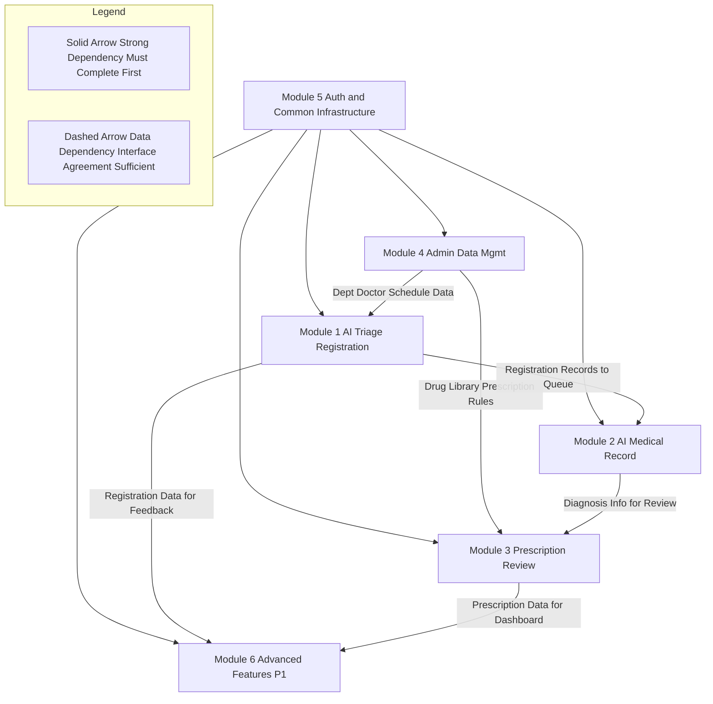
```mermaid
flowchart TB
    N_M5["Module 5 Auth and Common Infrastructure"] --> N_M1["Module 1 AI Triage Registration"]
    N_M5 --> N_M2["Module 2 AI Medical Record"]
    N_M5 --> N_M3["Module 3 Prescription Review"]
    N_M5 --> N_M4["Module 4 Admin Data Mgmt"]
    N_M5 --> N_M6["Module 6 Advanced Features P1"]

    N_M4 -->|"Dept Doctor Schedule Data"| N_M1
    N_M4 -->|"Drug Library Prescription Rules"| N_M3

    N_M1 -->|"Registration Records to Queue"| N_M2
    N_M2 -->|"Diagnosis Info for Review"| N_M3

    N_M1 -->|"Registration Data for Feedback"| N_M6
    N_M3 -->|"Prescription Data for Dashboard"| N_M6

    subgraph Legend["Legend"]
        L1["Solid Arrow Strong Dependency Must Complete First"]
        L2["Dashed Arrow Data Dependency Interface Agreement Sufficient"]
    end
```

---

## 4. 数据库设计

### 4.1 实体关系总览 ER 图

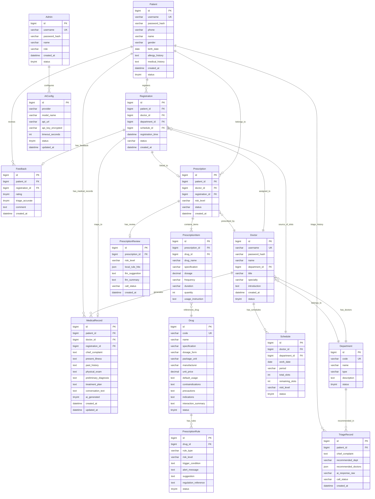
```mermaid
erDiagram
    Patient ||--o{ Registration : "registers"
    Patient ||--o{ TriageRecord : "triage_history"
    Patient ||--o{ Feedback : "reviews"
    Patient ||--o{ MedicalRecord : "has_medical_records"

    Doctor ||--o{ Registration : "assigned_to"
    Doctor }o--|| Department : "belongs_to"
    Doctor ||--o{ Schedule : "has_schedules"
    Doctor ||--o{ MedicalRecord : "generates"

    Department ||--o{ Doctor : "has_doctors"
    Department ||--o{ TriageRecord : "recommended_in"

    Registration ||--o| MedicalRecord : "maps_to"
    Registration ||--o| Feedback : "has_feedback"
    Registration ||--o| Prescription : "linked_to"

    Schedule ||--o{ Registration : "source_of_slots"

    Prescription ||--|{ PrescriptionItem : "contains_items"
    Prescription ||--o| PrescriptionReview : "has_review"
    Prescription }o--|| Doctor : "prescribed_by"
    Prescription }o--|| Patient : "belongs_to"

    PrescriptionItem }o--|| Drug : "references_drug"
    Drug ||--o{ PrescriptionRule : "has_rules"

    Admin ||--o{ AIConfig : "configures"

    Patient {
        bigint id PK
        varchar username UK
        varchar password_hash
        varchar phone
        varchar name
        varchar gender
        date birth_date
        text allergy_history
        text medical_history
        datetime created_at
        tinyint status
    }

    Doctor {
        bigint id PK
        varchar username UK
        varchar password_hash
        varchar name
        bigint department_id FK
        varchar title
        varchar specialty
        text introduction
        datetime created_at
        tinyint status
    }

    Admin {
        bigint id PK
        varchar username UK
        varchar password_hash
        varchar name
        varchar role
        datetime created_at
        tinyint status
    }

    Department {
        bigint id PK
        varchar code UK
        varchar name
        varchar type
        text description
        tinyint status
    }

    Schedule {
        bigint id PK
        bigint doctor_id FK
        bigint department_id FK
        date work_date
        varchar period
        int total_slots
        int remaining_slots
        varchar visit_level
        tinyint status
    }

    Registration {
        bigint id PK
        bigint patient_id FK
        bigint doctor_id FK
        bigint department_id FK
        bigint schedule_id FK
        datetime registration_time
        varchar status
        datetime created_at
    }

    TriageRecord {
        bigint id PK
        bigint patient_id FK
        text chief_complaint
        varchar recommended_dept
        json recommended_doctors
        varchar ai_response_raw
        varchar call_status
        datetime created_at
    }

    MedicalRecord {
        bigint id PK
        bigint patient_id FK
        bigint doctor_id FK
        bigint registration_id FK
        text chief_complaint
        text present_illness
        text past_history
        text physical_exam
        text preliminary_diagnosis
        text treatment_plan
        text conversation_text
        tinyint ai_generated
        datetime created_at
        datetime updated_at
    }

    Prescription {
        bigint id PK
        bigint patient_id FK
        bigint doctor_id FK
        bigint registration_id FK
        varchar risk_level
        varchar status
        datetime created_at
    }

    PrescriptionItem {
        bigint id PK
        bigint prescription_id FK
        bigint drug_id FK
        varchar drug_name
        varchar specification
        decimal dosage
        varchar frequency
        varchar duration
        int quantity
        text usage_instruction
    }

    Drug {
        bigint id PK
        varchar code UK
        varchar name
        varchar specification
        varchar dosage_form
        varchar package_unit
        varchar manufacturer
        decimal unit_price
        text default_usage
        text contraindications
        text precautions
        text indications
        text interaction_summary
        tinyint status
    }

    PrescriptionRule {
        bigint id PK
        bigint drug_id FK
        varchar rule_type
        varchar risk_level
        text trigger_condition
        text alert_message
        text suggestion
        text regulation_reference
        tinyint status
    }

    PrescriptionReview {
        bigint id PK
        bigint prescription_id FK
        varchar risk_level
        json local_rule_hits
        text llm_suggestion
        text llm_summary
        varchar call_status
        datetime created_at
    }

    Feedback {
        bigint id PK
        bigint patient_id FK
        bigint registration_id FK
        tinyint rating
        tinyint triage_accurate
        text comment
        datetime created_at
    }

    AIConfig {
        bigint id PK
        varchar provider
        varchar model_name
        varchar api_url
        varchar api_key_encrypted
        int timeout_seconds
        tinyint status
        datetime updated_at
    }
```

### 4.2 核心表结构设计

#### 模块一相关

| 表名              | 核心字段                                                                                       | 索引                                           |
| ----------------- | ---------------------------------------------------------------------------------------------- | ---------------------------------------------- |
| `patient`       | id, username, password_hash, phone, name, gender, birth_date, allergy_history, medical_history | UK(username), INDEX(phone)                     |
| `department`    | id, code, name, type, status                                                                   | UK(code)                                       |
| `doctor`        | id, username, password_hash, name, department_id, title, specialty, status                     | FK(department_id)                              |
| `schedule`      | id, doctor_id, department_id, work_date, period, total_slots, remaining_slots                  | FK(doctor_id, department_id), INDEX(work_date) |
| `registration`  | id, patient_id, doctor_id, department_id, schedule_id, registration_time, status               | FK(patient_id, doctor_id, schedule_id)         |
| `triage_record` | id, patient_id, chief_complaint, recommended_dept, recommended_doctors(JSON), call_status      | FK(patient_id)                                 |

#### 模块二相关

| 表名               | 核心字段                                                                                                                                                                          | 索引                                       |
| ------------------ | --------------------------------------------------------------------------------------------------------------------------------------------------------------------------------- | ------------------------------------------ |
| `medical_record` | id, patient_id, doctor_id, registration_id, chief_complaint, present_illness, past_history, physical_exam, preliminary_diagnosis, treatment_plan, conversation_text, ai_generated | FK(patient_id, doctor_id, registration_id) |

#### 模块三相关

| 表名                    | 核心字段                                                                                               | 索引                                       |
| ----------------------- | ------------------------------------------------------------------------------------------------------ | ------------------------------------------ |
| `prescription`        | id, patient_id, doctor_id, registration_id, risk_level, status                                         | FK(patient_id, doctor_id, registration_id) |
| `prescription_item`   | id, prescription_id, drug_id, drug_name, specification, dosage, frequency, duration, quantity          | FK(prescription_id, drug_id)               |
| `prescription_review` | id, prescription_id, risk_level, local_rule_hits(JSON), llm_suggestion, llm_summary, call_status       | FK(prescription_id)                        |
| `drug`                | id, code, name, specification, dosage_form, contraindications, interaction_summary, status             | UK(code), INDEX(name)                      |
| `prescription_rule`   | id, drug_id, rule_type, risk_level, trigger_condition, alert_message, suggestion, regulation_reference | FK(drug_id)                                |

#### 模块五/六相关

| 表名          | 核心字段                                                                      | 索引                            |
| ------------- | ----------------------------------------------------------------------------- | ------------------------------- |
| `admin`     | id, username, password_hash, name, role                                       | UK(username)                    |
| `ai_config` | id, provider, model_name, api_url, api_key_encrypted, timeout_seconds, status | —                              |
| `feedback`  | id, patient_id, registration_id, rating, triage_accurate, comment             | FK(patient_id, registration_id) |

---

## 5. 核心模块详细设计

### 5.1 模块一：智能分诊与挂号模块

#### 5.1.1 模块概述

**负责人**：成员 A

**职责**：

- AI 分诊：接收患者主诉 → 调用大模型 → 推荐科室与医生 → 持久化分诊记录
- 公开查询：科室列表/详情、医生列表/详情（供患者端浏览，无需登录）
- 号源查询：按医生 + 日期查询可用排班号源
- 挂号管理：创建挂号（扣减号源）、查询我的挂号、取消挂号（释放号源）

**依赖**：模块五（认证基础设施）、模块四（科室/医生/排班数据）

#### 5.1.2 类图

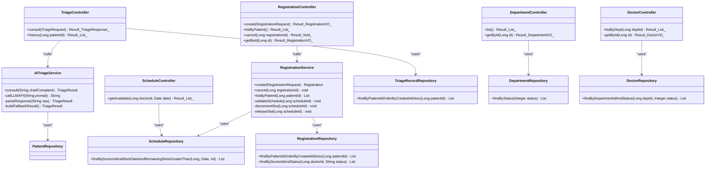
```mermaid
classDiagram
    direction TB

    class TriageController {
        +consult(TriageRequest) Result_TriageResponse_
        +history(Long patientId) Result_List_
    }

    class RegistrationController {
        +create(RegistrationRequest) Result_RegistrationVO_
        +listByPatient() Result_List_
        +cancel(Long registrationId) Result_Void_
        +getById(Long id) Result_RegistrationVO_
    }

    class DepartmentController {
        +list() Result_List_
        +getById(Long id) Result_DepartmentVO_
    }

    class DoctorController {
        +listByDept(Long deptId) Result_List_
        +getById(Long id) Result_DoctorVO_
    }

    class ScheduleController {
        +getAvailable(Long doctorId, Date date) Result_List_
    }

    class AITriageService {
        +consult(String chiefComplaint) TriageResult
        -callLLMAPI(String prompt) String
        -parseResponse(String raw) TriageResult
        -buildFallbackResult() TriageResult
    }

    class RegistrationService {
        +create(RegistrationRequest) Registration
        +cancel(Long registrationId) void
        +listByPatient(Long patientId) List
        -validateSchedule(Long scheduleId) void
        -decrementSlot(Long scheduleId) void
        -releaseSlot(Long scheduleId) void
    }

    class TriageRecordRepository {
        +findByPatientIdOrderByCreatedAtDesc(Long patientId) List
    }

    class RegistrationRepository {
        +findByPatientIdOrderByCreatedAtDesc(Long patientId) List
        +findByDoctorIdAndStatus(Long doctorId, String status) List
    }

    class ScheduleRepository {
        +findByDoctorIdAndWorkDateAndRemainingSlotsGreaterThan(Long, Date, int) List
    }

    class DepartmentRepository {
        +findByStatus(Integer status) List
    }

    class DoctorRepository {
        +findByDepartmentIdAndStatus(Long deptId, Integer status) List
    }

    TriageController --> AITriageService : "calls"
    TriageController --> TriageRecordRepository : "uses"
    RegistrationController --> RegistrationService : "calls"
    DepartmentController --> DepartmentRepository : "uses"
    DoctorController --> DoctorRepository : "uses"
    ScheduleController --> ScheduleRepository : "uses"
    RegistrationService --> ScheduleRepository : "uses"
    RegistrationService --> RegistrationRepository : "uses"
    AITriageService --> PatientRepository : "uses"
```

#### 5.1.3 核心时序图

**流程 A：智能分诊与挂号**

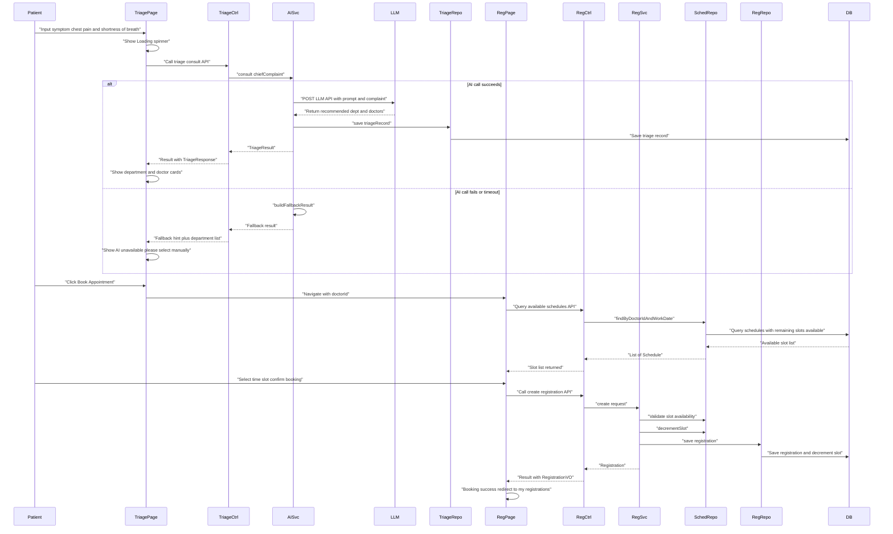
```mermaid
sequenceDiagram
    participant Patient
    participant TriagePage
    participant TriageCtrl
    participant AISvc
    participant LLM
    participant TriageRepo
    participant RegPage
    participant RegCtrl
    participant RegSvc
    participant SchedRepo
    participant RegRepo
    participant DB

    Patient->>TriagePage: "Input symptom chest pain and shortness of breath"
    TriagePage->>TriagePage: "Show Loading spinner"
    TriagePage->>TriageCtrl: "Call triage consult API"
    TriageCtrl->>AISvc: "consult chiefComplaint"

    alt AI call succeeds
        AISvc->>LLM: "POST LLM API with prompt and complaint"
        LLM-->>AISvc: "Return recommended dept and doctors"
        AISvc->>TriageRepo: "save triageRecord"
        TriageRepo->>DB: "Save triage record"
        AISvc-->>TriageCtrl: "TriageResult"
        TriageCtrl-->>TriagePage: "Result with TriageResponse"
        TriagePage->>TriagePage: "Show department and doctor cards"
    else AI call fails or timeout
        AISvc->>AISvc: "buildFallbackResult"
        AISvc-->>TriageCtrl: "Fallback result"
        TriageCtrl-->>TriagePage: "Fallback hint plus department list"
        TriagePage->>TriagePage: "Show AI unavailable please select manually"
    end

    Patient->>TriagePage: "Click Book Appointment"
    TriagePage->>RegPage: "Navigate with doctorId"
    RegPage->>RegCtrl: "Query available schedules API"
    RegCtrl->>SchedRepo: "findByDoctorIdAndWorkDate"
    SchedRepo->>DB: "Query schedules with remaining slots available"
    DB-->>SchedRepo: "Available slot list"
    SchedRepo-->>RegCtrl: "List of Schedule"
    RegCtrl-->>RegPage: "Slot list returned"

    Patient->>RegPage: "Select time slot confirm booking"
    RegPage->>RegCtrl: "Call create registration API"
    RegCtrl->>RegSvc: "create request"
    RegSvc->>SchedRepo: "Validate slot availability"
    RegSvc->>SchedRepo: "decrementSlot"
    RegSvc->>RegRepo: "save registration"
    RegRepo->>DB: "Save registration and decrement slot"
    RegSvc-->>RegCtrl: "Registration"
    RegCtrl-->>RegPage: "Result with RegistrationVO"
    RegPage->>RegPage: "Booking success redirect to my registrations"
```

**流程 B：取消挂号（号源释放）**

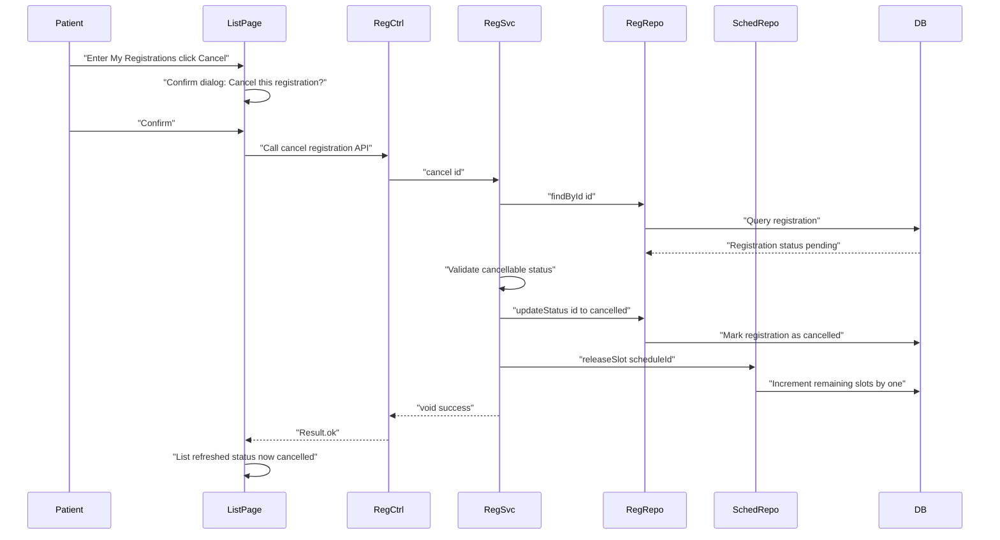
```mermaid
sequenceDiagram
    participant Patient
    participant ListPage
    participant RegCtrl
    participant RegSvc
    participant RegRepo
    participant SchedRepo
    participant DB

    Patient->>ListPage: "Enter My Registrations click Cancel"
    ListPage->>ListPage: "Confirm dialog: Cancel this registration?"
    Patient->>ListPage: "Confirm"
    ListPage->>RegCtrl: "Call cancel registration API"
    RegCtrl->>RegSvc: "cancel id"

    RegSvc->>RegRepo: "findById id"
    RegRepo->>DB: "Query registration"
    DB-->>RegRepo: "Registration status pending"
    RegSvc->>RegSvc: "Validate cancellable status"

    RegSvc->>RegRepo: "updateStatus id to cancelled"
    RegRepo->>DB: "Mark registration as cancelled"
    RegSvc->>SchedRepo: "releaseSlot scheduleId"
    SchedRepo->>DB: "Increment remaining slots by one"

    RegSvc-->>RegCtrl: "void success"
    RegCtrl-->>ListPage: "Result.ok"
    ListPage->>ListPage: "List refreshed status now cancelled"
```

---

### 5.2 模块二：AI 病历生成模块

#### 5.2.1 模块概述

**负责人**：成员 B

**职责**：问诊对话录入 → 调用 AI 病历生成引擎 → 结构化字段回填表单 → 医生编辑确认 → 保存病历 → 标记挂号完成。提供病历列表与按患者搜索功能。

**依赖**：模块五（认证）、模块一（挂号信息）

#### 5.2.2 类图

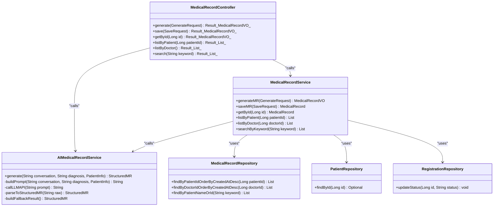
```mermaid
classDiagram
    direction TB

    class MedicalRecordController {
        +generate(GenerateRequest) Result_MedicalRecordVO_
        +save(SaveRequest) Result_MedicalRecordVO_
        +getById(Long id) Result_MedicalRecordVO_
        +listByPatient(Long patientId) Result_List_
        +listByDoctor() Result_List_
        +search(String keyword) Result_List_
    }

    class AIMedicalRecordService {
        +generate(String conversation, String diagnosis, PatientInfo) StructuredMR
        -buildPrompt(String conversation, String diagnosis, PatientInfo) String
        -callLLMAPI(String prompt) String
        -parseToStructuredMR(String raw) StructuredMR
        -buildFallbackResult() StructuredMR
    }

    class MedicalRecordService {
        +generateMR(GenerateRequest) MedicalRecordVO
        +saveMR(SaveRequest) MedicalRecord
        +getById(Long id) MedicalRecord
        +listByPatient(Long patientId) List
        +listByDoctor(Long doctorId) List
        +searchByKeyword(String keyword) List
    }

    class MedicalRecordRepository {
        +findByPatientIdOrderByCreatedAtDesc(Long patientId) List
        +findByDoctorIdOrderByCreatedAtDesc(Long doctorId) List
        +findByPatientNameOrId(String keyword) List
    }

    class PatientRepository {
        +findById(Long id) Optional
    }

    class RegistrationRepository {
        +updateStatus(Long id, String status) void
    }

    MedicalRecordController --> MedicalRecordService : "calls"
    MedicalRecordController --> AIMedicalRecordService : "calls"
    MedicalRecordService --> AIMedicalRecordService : "calls"
    MedicalRecordService --> MedicalRecordRepository : "uses"
    MedicalRecordService --> PatientRepository : "uses"
    MedicalRecordService --> RegistrationRepository : "uses"
```

#### 5.2.3 核心时序图

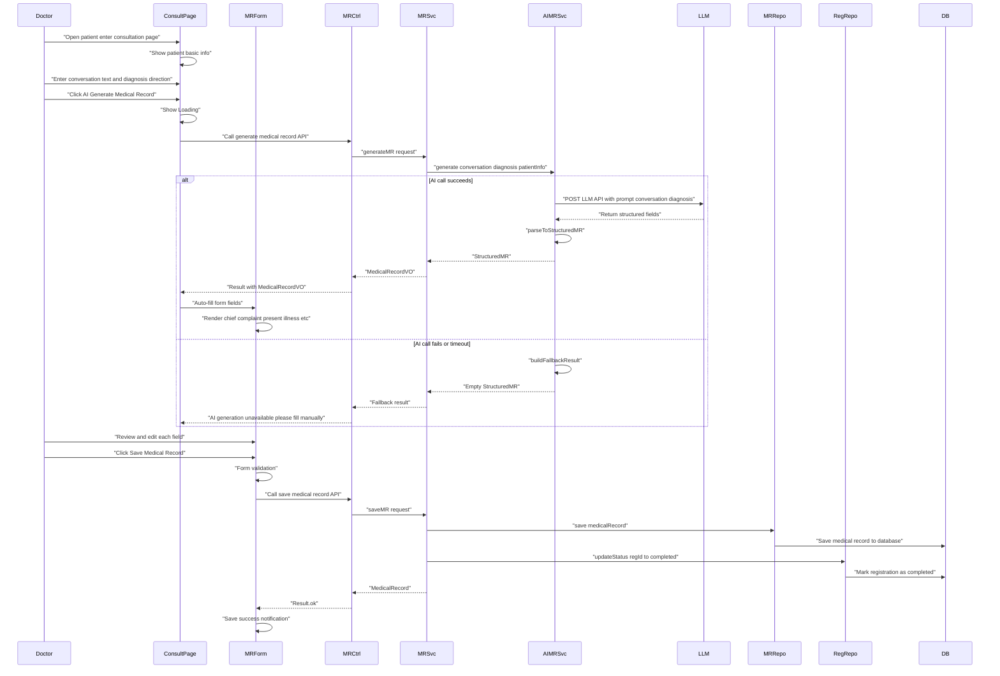
```mermaid
sequenceDiagram
    participant Doctor
    participant ConsultPage
    participant MRForm
    participant MRCtrl
    participant MRSvc
    participant AIMRSvc
    participant LLM
    participant MRRepo
    participant RegRepo
    participant DB

    Doctor->>ConsultPage: "Open patient enter consultation page"
    ConsultPage->>ConsultPage: "Show patient basic info"

    Doctor->>ConsultPage: "Enter conversation text and diagnosis direction"
    Doctor->>ConsultPage: "Click AI Generate Medical Record"
    ConsultPage->>ConsultPage: "Show Loading"

    ConsultPage->>MRCtrl: "Call generate medical record API"
    MRCtrl->>MRSvc: "generateMR request"
    MRSvc->>AIMRSvc: "generate conversation diagnosis patientInfo"

    alt AI call succeeds
        AIMRSvc->>LLM: "POST LLM API with prompt conversation diagnosis"
        LLM-->>AIMRSvc: "Return structured fields"
        AIMRSvc->>AIMRSvc: "parseToStructuredMR"
        AIMRSvc-->>MRSvc: "StructuredMR"
        MRSvc-->>MRCtrl: "MedicalRecordVO"
        MRCtrl-->>ConsultPage: "Result with MedicalRecordVO"
        ConsultPage->>MRForm: "Auto-fill form fields"
        MRForm->>MRForm: "Render chief complaint present illness etc"
    else AI call fails or timeout
        AIMRSvc->>AIMRSvc: "buildFallbackResult"
        AIMRSvc-->>MRSvc: "Empty StructuredMR"
        MRSvc-->>MRCtrl: "Fallback result"
        MRCtrl-->>ConsultPage: "AI generation unavailable please fill manually"
    end

    Doctor->>MRForm: "Review and edit each field"
    Doctor->>MRForm: "Click Save Medical Record"
    MRForm->>MRForm: "Form validation"

    MRForm->>MRCtrl: "Call save medical record API"
    MRCtrl->>MRSvc: "saveMR request"
    MRSvc->>MRRepo: "save medicalRecord"
    MRRepo->>DB: "Save medical record to database"
    MRSvc->>RegRepo: "updateStatus regId to completed"
    RegRepo->>DB: "Mark registration as completed"

    MRSvc-->>MRCtrl: "MedicalRecord"
    MRCtrl-->>MRForm: "Result.ok"
    MRForm->>MRForm: "Save success notification"
```

---

### 5.3 模块三：处方审核与开具模块

#### 5.3.1 模块概述

**负责人**：成员 C

**职责**：从药品库选择药品 → 开具处方 → 本地规则引擎审核 → 大模型解释补充 → 审核结果展示 → 医生调整 → 提交保存。处方列表与审核记录查询。

**核心设计——"本地规则优先 + 大模型解释"**：

```
处方提交
  → 本地规则引擎 查禁忌 相互作用 剂量范围 → 命中规则列表
  → 大模型 基于命中规则 处方上下文 生成解释建议 → 自然语言解释
  → 合并返回 规则命中项 风险等级 大模型解释
```

**依赖**：模块五（认证）、模块四（药品库/处方规则）、模块二（患者诊断信息）

#### 5.3.2 类图

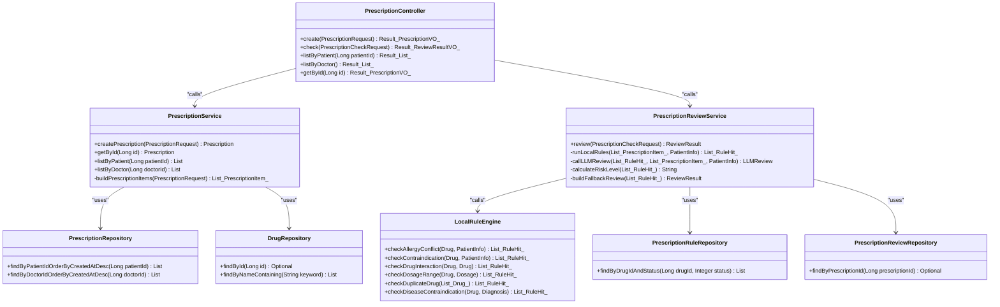
```mermaid
classDiagram
    direction TB

    class PrescriptionController {
        +create(PrescriptionRequest) Result_PrescriptionVO_
        +check(PrescriptionCheckRequest) Result_ReviewResultVO_
        +listByPatient(Long patientId) Result_List_
        +listByDoctor() Result_List_
        +getById(Long id) Result_PrescriptionVO_
    }

    class PrescriptionService {
        +createPrescription(PrescriptionRequest) Prescription
        +getById(Long id) Prescription
        +listByPatient(Long patientId) List
        +listByDoctor(Long doctorId) List
        -buildPrescriptionItems(PrescriptionRequest) List_PrescriptionItem_
    }

    class PrescriptionReviewService {
        +review(PrescriptionCheckRequest) ReviewResult
        -runLocalRules(List_PrescriptionItem_, PatientInfo) List_RuleHit_
        -callLLMReview(List_RuleHit_, List_PrescriptionItem_, PatientInfo) LLMReview
        -calculateRiskLevel(List_RuleHit_) String
        -buildFallbackReview(List_RuleHit_) ReviewResult
    }

    class LocalRuleEngine {
        +checkAllergyConflict(Drug, PatientInfo) List_RuleHit_
        +checkContraindication(Drug, PatientInfo) List_RuleHit_
        +checkDrugInteraction(Drug, Drug) List_RuleHit_
        +checkDosageRange(Drug, Dosage) List_RuleHit_
        +checkDuplicateDrug(List_Drug_) List_RuleHit_
        +checkDiseaseContraindication(Drug, Diagnosis) List_RuleHit_
    }

    class DrugRepository {
        +findById(Long id) Optional
        +findByNameContaining(String keyword) List
    }

    class PrescriptionRuleRepository {
        +findByDrugIdAndStatus(Long drugId, Integer status) List
    }

    class PrescriptionRepository {
        +findByPatientIdOrderByCreatedAtDesc(Long patientId) List
        +findByDoctorIdOrderByCreatedAtDesc(Long doctorId) List
    }

    class PrescriptionReviewRepository {
        +findByPrescriptionId(Long prescriptionId) Optional
    }

    PrescriptionController --> PrescriptionService : "calls"
    PrescriptionController --> PrescriptionReviewService : "calls"
    PrescriptionReviewService --> LocalRuleEngine : "calls"
    PrescriptionReviewService --> PrescriptionRuleRepository : "uses"
    PrescriptionReviewService --> PrescriptionReviewRepository : "uses"
    PrescriptionService --> PrescriptionRepository : "uses"
    PrescriptionService --> DrugRepository : "uses"
```

#### 5.3.3 核心时序图

**流程 A：处方审核（本地规则 + 大模型）**

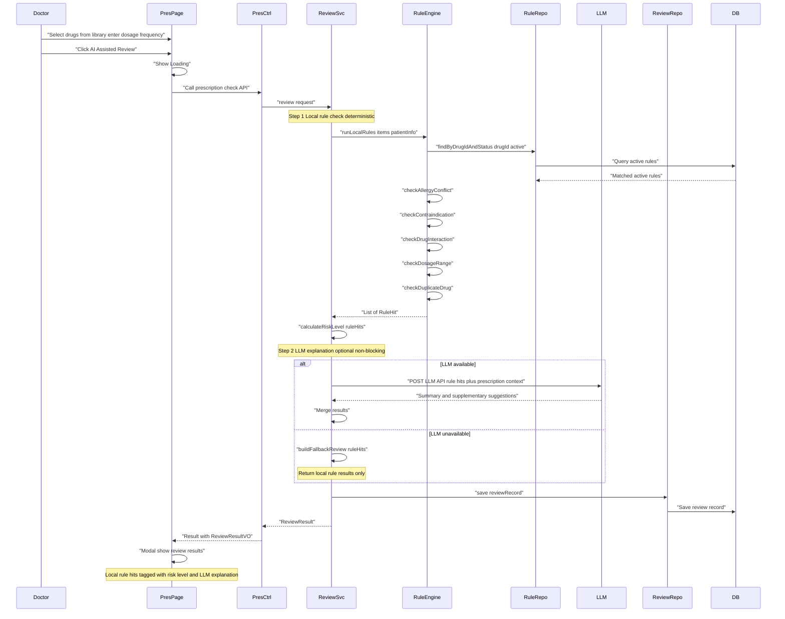
```mermaid
sequenceDiagram
    participant Doctor
    participant PresPage
    participant PresCtrl
    participant ReviewSvc
    participant RuleEngine
    participant RuleRepo
    participant LLM
    participant ReviewRepo
    participant DB

    Doctor->>PresPage: "Select drugs from library enter dosage frequency"
    Doctor->>PresPage: "Click AI Assisted Review"
    PresPage->>PresPage: "Show Loading"

    PresPage->>PresCtrl: "Call prescription check API"
    PresCtrl->>ReviewSvc: "review request"

    Note over ReviewSvc: Step 1 Local rule check deterministic
    ReviewSvc->>RuleEngine: "runLocalRules items patientInfo"
    RuleEngine->>RuleRepo: "findByDrugIdAndStatus drugId active"
    RuleRepo->>DB: "Query active rules"
    DB-->>RuleRepo: "Matched active rules"
    RuleEngine->>RuleEngine: "checkAllergyConflict"
    RuleEngine->>RuleEngine: "checkContraindication"
    RuleEngine->>RuleEngine: "checkDrugInteraction"
    RuleEngine->>RuleEngine: "checkDosageRange"
    RuleEngine->>RuleEngine: "checkDuplicateDrug"
    RuleEngine-->>ReviewSvc: "List of RuleHit"

    ReviewSvc->>ReviewSvc: "calculateRiskLevel ruleHits"

    Note over ReviewSvc: Step 2 LLM explanation optional non-blocking
    alt LLM available
        ReviewSvc->>LLM: "POST LLM API rule hits plus prescription context"
        LLM-->>ReviewSvc: "Summary and supplementary suggestions"
        ReviewSvc->>ReviewSvc: "Merge results"
    else LLM unavailable
        ReviewSvc->>ReviewSvc: "buildFallbackReview ruleHits"
        Note over ReviewSvc: Return local rule results only
    end

    ReviewSvc->>ReviewRepo: "save reviewRecord"
    ReviewRepo->>DB: "Save review record"

    ReviewSvc-->>PresCtrl: "ReviewResult"
    PresCtrl-->>PresPage: "Result with ReviewResultVO"

    PresPage->>PresPage: "Modal show review results"
    Note over PresPage: Local rule hits tagged with risk level and LLM explanation
```

**流程 B：处方提交保存**

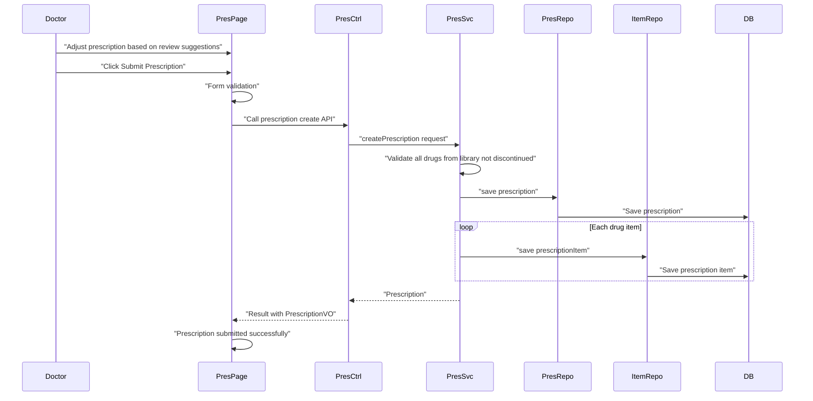
```mermaid
sequenceDiagram
    participant Doctor
    participant PresPage
    participant PresCtrl
    participant PresSvc
    participant PresRepo
    participant ItemRepo
    participant DB

    Doctor->>PresPage: "Adjust prescription based on review suggestions"
    Doctor->>PresPage: "Click Submit Prescription"
    PresPage->>PresPage: "Form validation"

    PresPage->>PresCtrl: "Call prescription create API"
    PresCtrl->>PresSvc: "createPrescription request"

    PresSvc->>PresSvc: "Validate all drugs from library not discontinued"
    PresSvc->>PresRepo: "save prescription"
    PresRepo->>DB: "Save prescription"

    loop Each drug item
        PresSvc->>ItemRepo: "save prescriptionItem"
        ItemRepo->>DB: "Save prescription item"
    end

    PresSvc-->>PresCtrl: "Prescription"
    PresCtrl-->>PresPage: "Result with PrescriptionVO"
    PresPage->>PresPage: "Prescription submitted successfully"
```

---

### 5.4 模块四：管理端基础数据模块

#### 5.4.1 模块概述

**负责人**：成员 D

**职责**：管理端全部基础数据维护——科室 CRUD、医生 CRUD、排班号源 CRUD 及批量创建、药品库 CRUD、处方审核规则 CRUD、AI 服务配置、AI 调用记录查看。

**被依赖**：模块一（科室/医生/排班）、模块三（药品库/规则）

#### 5.4.2 类图


```mermaid
classDiagram
    direction TB

    class AdminDepartmentController {
        +list() Result_List_
        +getById(Long id) Result_DepartmentVO_
        +create(DepartmentRequest) Result_DepartmentVO_
        +update(Long id, DepartmentRequest) Result_DepartmentVO_
        +toggleStatus(Long id) Result_Void_
    }

    class AdminDoctorController {
        +list(Long deptId) Result_List_
        +getById(Long id) Result_DoctorVO_
        +create(DoctorRequest) Result_DoctorVO_
        +update(Long id, DoctorRequest) Result_DoctorVO_
        +toggleStatus(Long id) Result_Void_
    }

    class AdminScheduleController {
        +list(Long doctorId, Date from, Date to) Result_List_
        +create(ScheduleRequest) Result_ScheduleVO_
        +update(Long id, ScheduleRequest) Result_ScheduleVO_
        +toggleStatus(Long id) Result_Void_
        +batchCreate(BatchScheduleRequest) Result_List_
    }

    class AdminDrugController {
        +list(String keyword, Integer status) Result_List_
        +getById(Long id) Result_DrugVO_
        +create(DrugRequest) Result_DrugVO_
        +update(Long id, DrugRequest) Result_DrugVO_
        +toggleStatus(Long id) Result_Void_
    }

    class AdminRuleController {
        +list(Long drugId, String ruleType) Result_List_
        +create(RuleRequest) Result_RuleVO_
        +update(Long id, RuleRequest) Result_RuleVO_
        +toggleStatus(Long id) Result_Void_
    }

    class AdminAIConfigController {
        +getConfig() Result_AIConfigVO_
        +updateConfig(AIConfigRequest) Result_AIConfigVO_
        +listTriageRecords() Result_Page_
        +listMRRecords() Result_Page_
        +listReviewRecords() Result_Page_
    }

    class DepartmentService {
        +list() List_Department_
        +create(DepartmentRequest) Department
        +update(Long id, DepartmentRequest) Department
        +toggleStatus(Long id) void
    }

    class DoctorService {
        +listByDept(Long deptId) List_Doctor_
        +create(DoctorRequest) Doctor
        +update(Long id, DoctorRequest) Doctor
        +toggleStatus(Long id) void
    }

    class ScheduleService {
        +list(Long doctorId, DateRange) List_Schedule_
        +create(ScheduleRequest) Schedule
        +batchCreate(BatchScheduleRequest) List_Schedule_
        +toggleStatus(Long id) void
    }

    class DrugService {
        +list(String keyword, Integer status) List_Drug_
        +create(DrugRequest) Drug
        +update(Long id, DrugRequest) Drug
        +toggleStatus(Long id) void
    }

    class PrescriptionRuleService {
        +list(Long drugId, String ruleType) List_PrescriptionRule_
        +create(RuleRequest) PrescriptionRule
        +update(Long id, RuleRequest) PrescriptionRule
        +toggleStatus(Long id) void
    }

    class AIConfigService {
        +getConfig() AIConfig
        +updateConfig(AIConfigRequest) AIConfig
        +listTriageRecords(Pageable) Page_TriageRecord_
        +listMRRecords(Pageable) Page_MedicalRecord_
        +listReviewRecords(Pageable) Page_PrescriptionReview_
    }

    AdminDepartmentController --> DepartmentService : "calls"
    AdminDoctorController --> DoctorService : "calls"
    AdminScheduleController --> ScheduleService : "calls"
    AdminDrugController --> DrugService : "calls"
    AdminRuleController --> PrescriptionRuleService : "calls"
    AdminAIConfigController --> AIConfigService : "calls"

    DepartmentService --> DepartmentRepository : "uses"
    DoctorService --> DoctorRepository : "uses"
    ScheduleService --> ScheduleRepository : "uses"
    DrugService --> DrugRepository : "uses"
    PrescriptionRuleService --> PrescriptionRuleRepository : "uses"
    AIConfigService --> AIConfigRepository : "uses"
```

#### 5.4.3 核心时序图

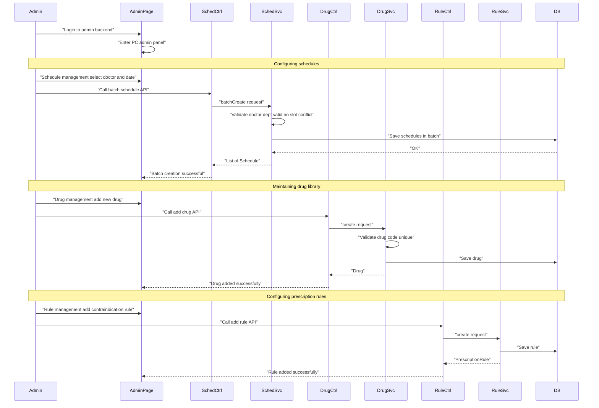
```mermaid
sequenceDiagram
    participant Admin
    participant AdminPage
    participant SchedCtrl
    participant SchedSvc
    participant DrugCtrl
    participant DrugSvc
    participant RuleCtrl
    participant RuleSvc
    participant DB

    Admin->>AdminPage: "Login to admin backend"
    AdminPage->>AdminPage: "Enter PC admin panel"

    Note over Admin,DB: Configuring schedules
    Admin->>AdminPage: "Schedule management select doctor and date"
    Admin->>SchedCtrl: "Call batch schedule API"
    SchedCtrl->>SchedSvc: "batchCreate request"
    SchedSvc->>SchedSvc: "Validate doctor dept valid no slot conflict"
    SchedSvc->>DB: "Save schedules in batch"
    DB-->>SchedSvc: "OK"
    SchedSvc-->>SchedCtrl: "List of Schedule"
    SchedCtrl-->>AdminPage: "Batch creation successful"

    Note over Admin,DB: Maintaining drug library
    Admin->>AdminPage: "Drug management add new drug"
    Admin->>DrugCtrl: "Call add drug API"
    DrugCtrl->>DrugSvc: "create request"
    DrugSvc->>DrugSvc: "Validate drug code unique"
    DrugSvc->>DB: "Save drug"
    DrugSvc-->>DrugCtrl: "Drug"
    DrugCtrl-->>AdminPage: "Drug added successfully"

    Note over Admin,DB: Configuring prescription rules
    Admin->>AdminPage: "Rule management add contraindication rule"
    Admin->>RuleCtrl: "Call add rule API"
    RuleCtrl->>RuleSvc: "create request"
    RuleSvc->>DB: "Save rule"
    RuleSvc-->>RuleCtrl: "PrescriptionRule"
    RuleCtrl-->>AdminPage: "Rule added successfully"
```

---

### 5.5 模块五：用户认证与通用基础设施模块

#### 5.5.1 模块概述

**负责人**：成员 E（最先完成，为其他模块提供基础）

**职责**：

- 三端认证：患者注册/登录、医生登录、管理员登录，JWT 签发与验证
- 患者信息查询与更新
- 通用基础设施：统一响应结构 Result、全局异常处理器、CORS 跨域配置、Swagger/Knife4j 文档
- 前端基础设施：Vite 项目创建、Axios 封装（请求/响应拦截器）、Vite 代理配置
- 联调支撑：JWT 自动携带、401 拦截跳转、跨域问题处理

**前置任务（项目初始化 F01-F06）**：Spring Boot 3 + Vue 3 项目脚手架、MySQL 配置、Knife4j、CORS、统一响应结构、Axios 封装

#### 5.5.2 类图


```mermaid
classDiagram
    direction TB

    class AuthController {
        +patientLogin(LoginRequest) Result_LoginResponse_
        +patientRegister(RegisterRequest) Result_Void_
        +doctorLogin(LoginRequest) Result_LoginResponse_
        +adminLogin(LoginRequest) Result_LoginResponse_
    }

    class PatientController {
        +getInfo() Result_PatientVO_
        +updateInfo(PatientUpdateRequest) Result_PatientVO_
    }

    class AuthService {
        +patientLogin(String username, String password) LoginResponse
        +patientRegister(RegisterRequest) void
        +doctorLogin(String username, String password) LoginResponse
        +adminLogin(String username, String password) LoginResponse
        -authenticate(String username, String password, UserDetails) boolean
        -generateToken(Long userId, String role) String
    }

    class JwtTokenUtil {
        +generateToken(Long userId, String role) String
        +validateToken(String token) boolean
        +getUserIdFromToken(String token) Long
        +getRoleFromToken(String token) String
    }

    class JwtAuthenticationFilter {
        +doFilterInternal(request, response, filterChain) void
        -extractToken(HttpServletRequest) String
        -setAuthenticationContext(Long userId, String role) void
    }

    class SecurityConfig {
        +securityFilterChain(HttpSecurity) SecurityFilterChain
        +passwordEncoder() PasswordEncoder
    }

    class CorsConfig {
        +corsFilter() CorsFilter
        +addCorsMappings(CorsRegistry) void
    }

    class GlobalExceptionHandler {
        +handleBusinessException(BusinessException) Result
        +handleValidationException(MethodArgumentNotValidException) Result
        +handleAuthenticationException(AuthenticationException) Result
        +handleGenericException(Exception) Result
    }

    class PatientRepository {
        +findByUsername(String username) Optional
        +findByPhone(String phone) Optional
    }

    class DoctorRepository {
        +findByUsername(String username) Optional
    }

    class AdminRepository {
        +findByUsername(String username) Optional
    }

    AuthController --> AuthService : "calls"
    PatientController --> PatientService : "calls"
    AuthService --> JwtTokenUtil : "uses"
    AuthService --> PatientRepository : "uses"
    AuthService --> DoctorRepository : "uses"
    AuthService --> AdminRepository : "uses"
    JwtAuthenticationFilter --> JwtTokenUtil : "uses"
    GlobalExceptionHandler --> Result : "returns"
```

#### 5.5.3 核心时序图

**流程 A：患者登录 + JWT 认证**

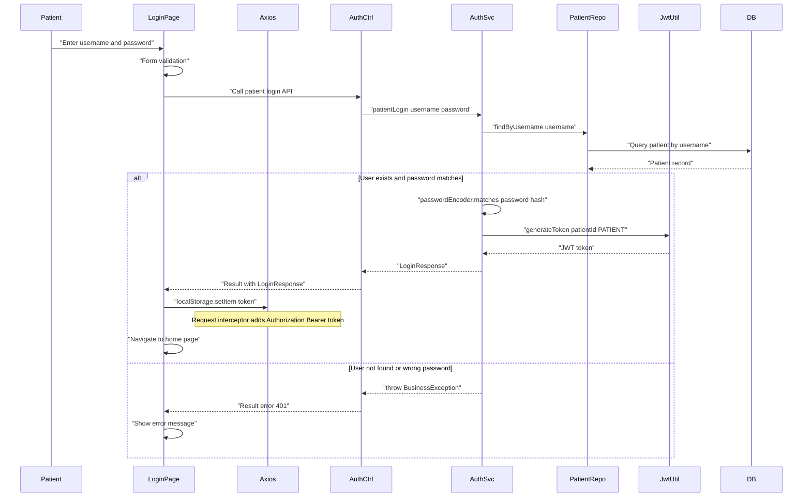
```mermaid
sequenceDiagram
    participant Patient
    participant LoginPage
    participant Axios
    participant AuthCtrl
    participant AuthSvc
    participant PatientRepo
    participant JwtUtil
    participant DB

    Patient->>LoginPage: "Enter username and password"
    LoginPage->>LoginPage: "Form validation"
    LoginPage->>AuthCtrl: "Call patient login API"
    AuthCtrl->>AuthSvc: "patientLogin username password"

    AuthSvc->>PatientRepo: "findByUsername username"
    PatientRepo->>DB: "Query patient by username"
    DB-->>PatientRepo: "Patient record"

    alt User exists and password matches
        AuthSvc->>AuthSvc: "passwordEncoder.matches password hash"
        AuthSvc->>JwtUtil: "generateToken patientId PATIENT"
        JwtUtil-->>AuthSvc: "JWT token"
        AuthSvc-->>AuthCtrl: "LoginResponse"
        AuthCtrl-->>LoginPage: "Result with LoginResponse"

        LoginPage->>Axios: "localStorage.setItem token"
        Note over Axios: Request interceptor adds Authorization Bearer token
        LoginPage->>LoginPage: "Navigate to home page"
    else User not found or wrong password
        AuthSvc-->>AuthCtrl: "throw BusinessException"
        AuthCtrl-->>LoginPage: "Result error 401"
        LoginPage->>LoginPage: "Show error message"
    end
```

**流程 B：JWT 鉴权拦截流程**

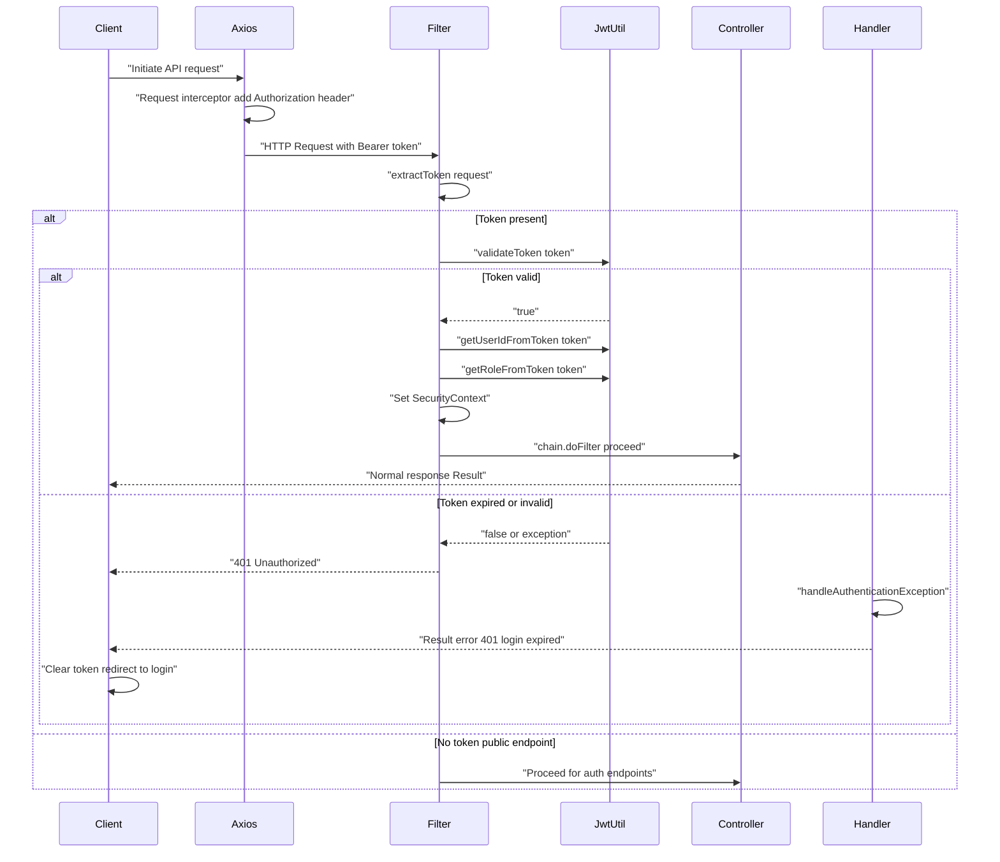
```mermaid
sequenceDiagram
    participant Client
    participant Axios
    participant Filter
    participant JwtUtil
    participant Controller
    participant Handler

    Client->>Axios: "Initiate API request"
    Axios->>Axios: "Request interceptor add Authorization header"

    Axios->>Filter: "HTTP Request with Bearer token"
    Filter->>Filter: "extractToken request"

    alt Token present
        Filter->>JwtUtil: "validateToken token"
        alt Token valid
            JwtUtil-->>Filter: "true"
            Filter->>JwtUtil: "getUserIdFromToken token"
            Filter->>JwtUtil: "getRoleFromToken token"
            Filter->>Filter: "Set SecurityContext"
            Filter->>Controller: "chain.doFilter proceed"
            Controller-->>Client: "Normal response Result"
        else Token expired or invalid
            JwtUtil-->>Filter: "false or exception"
            Filter-->>Client: "401 Unauthorized"
            Handler->>Handler: "handleAuthenticationException"
            Handler-->>Client: "Result error 401 login expired"
            Client->>Client: "Clear token redirect to login"
        end
    else No token public endpoint
        Filter->>Controller: "Proceed for auth endpoints"
    end
```

**流程 C：全局异常处理**

```mermaid
sequenceDiagram
    participant Ctrl
    participant Svc
    participant Handler

    Ctrl->>Svc: "Call business method"
    Svc->>Svc: "Business logic"

    alt Validation failure
        Svc-->>Ctrl: "throw BusinessException 400 invalid format"
        Ctrl-->>Handler: "Exception bubbles up"
        Handler->>Handler: "handleBusinessException"
        Handler-->>Ctrl: "Result error 400 message"
    else Not authenticated
        Ctrl-->>Handler: "throw AuthenticationException"
        Handler->>Handler: "handleAuthenticationException"
        Handler-->>Ctrl: "Result error 401 not logged in"
    else Unknown error
        Svc-->>Ctrl: "throw RuntimeException"
        Ctrl-->>Handler: "Exception bubbles up"
        Handler->>Handler: "handleGenericException log error"
        Handler-->>Ctrl: "Result error 500 internal server error"
    end
```

---

### 5.6 模块六：P1 进阶能力模块

#### 5.6.1 模块概述

**负责人**：由 P0 模块先完成的成员认领

**职责**：覆盖 PRD 中全部 P1 能力——AI 诊疗建议、就诊评价与反馈、数据可视化看板、SSE 流式病历生成、Pinia 状态机模块化、可配置 Prompt 模板。WebSocket 实时通知和双端分离部署、微服务拆分属于 E04-E09 拓展，在本模块中做概要设计。

#### 5.6.2 类图

```mermaid
classDiagram
    direction TB

    class AIDiagnosisController {
        +suggest(DiagnosisRequest) Result_DiagnosisListVO_
    }

    class AIDiagnosisService {
        +suggest(String conversation, PatientInfo) List_DiagnosisSuggestion_
        -buildPrompt(String conversation, PatientInfo) String
        -callLLMAPI(String prompt) String
        -parseSuggestions(String raw) List_DiagnosisSuggestion_
    }

    class FeedbackController {
        +create(FeedbackRequest) Result_FeedbackVO_
        +getByRegistration(Long regId) Result_FeedbackVO_
        +listByPatient() Result_List_
    }

    class FeedbackService {
        +create(FeedbackRequest) Feedback
        +getByRegistration(Long regId) Feedback
        +listByPatient(Long patientId) List
        +getTriageAccuracyStats() TriageAccuracyVO
    }

    class DashboardController {
        +getOverview() Result_DashboardOverview_
        +getAIUsageStats() Result_AIUsageStats_
        +getPrescriptionRiskDist() Result_RiskDistribution_
        +getTriageAccuracy() Result_TriageAccuracyVO_
    }

    class DashboardService {
        +getOverview(Long doctorId) DashboardOverview
        +getAIUsageStats(Long doctorId) AIUsageStats
        +getPrescriptionRiskDist(Long doctorId) RiskDistribution
        +getTriageAccuracy() TriageAccuracyVO
        -aggregateRegistrationCounts(Long doctorId) Map
        -aggregateAICallCounts(Long doctorId) Map
    }

    class SSEMedicalRecordController {
        +generateStream(GenerateRequest) SseEmitter
    }

    class AIMedicalRecordService {
        +generateStream(String conversation, String diagnosis, PatientInfo) Flux_String_
    }

    class PromptTemplateService {
        +getTemplate(String deptCode, String aiType) PromptTemplate
        +listTemplates() List_PromptTemplate_
        +updateTemplate(String deptCode, PromptTemplate) void
    }

    class FeedbackRepository {
        +findByRegistrationId(Long regId) Optional
        +findByPatientIdOrderByCreatedAtDesc(Long patientId) List
        +countByTriageAccurate(Boolean accurate) Long
    }

    AIDiagnosisController --> AIDiagnosisService : "calls"
    FeedbackController --> FeedbackService : "calls"
    DashboardController --> DashboardService : "calls"
    SSEMedicalRecordController --> AIMedicalRecordService : "calls"
    AIDiagnosisService --> AIDiagnosisRecordRepository : "uses"
    FeedbackService --> FeedbackRepository : "uses"
    DashboardService --> RegistrationRepository : "uses"
    DashboardService --> TriageRecordRepository : "uses"
    DashboardService --> PrescriptionReviewRepository : "uses"
    DashboardService --> FeedbackRepository : "uses"
    PromptTemplateService --> PromptTemplateRepository : "uses"
```

#### 5.6.3 核心时序图

**流程 A：AI 诊疗建议（P1）**

```mermaid
sequenceDiagram
    participant Doctor
    participant ConsultPage
    participant DiagCtrl
    participant DiagSvc
    participant LLM
    participant DiagRepo
    participant DB

    Doctor->>ConsultPage: "Enter conversation text"
    Doctor->>ConsultPage: "Click AI Diagnosis Suggestions P1"
    ConsultPage->>ConsultPage: "Show Loading"

    ConsultPage->>DiagCtrl: "Call diagnosis suggest API"
    DiagCtrl->>DiagSvc: "suggest conversation patientInfo"

    alt AI call succeeds
        DiagSvc->>LLM: "POST LLM API with prompt and conversation"
        LLM-->>DiagSvc: "Return diagnosis suggestions with confidence"
        DiagSvc->>DiagSvc: "parseSuggestions"
        DiagSvc->>DiagRepo: "save diagnosisRecord"
        DiagRepo->>DB: "Save diagnosis record"
        DiagSvc-->>DiagCtrl: "List of DiagnosisSuggestion"
        DiagCtrl-->>ConsultPage: "Result with DiagnosisListVO"
        ConsultPage->>ConsultPage: "Show suggestion cards with confidence scores"
    else AI call fails
        DiagSvc-->>DiagCtrl: "Fallback result"
        DiagCtrl-->>ConsultPage: "AI suggestion unavailable please judge manually"
        ConsultPage->>ConsultPage: "Show fallback hint"
    end
```

**流程 B：就诊评价（P1）**

```mermaid
sequenceDiagram
    participant Patient
    participant RegDetail
    participant FbCtrl
    participant FbSvc
    participant FbRepo
    participant DB

    Patient->>RegDetail: "View completed registration click Evaluate"
    RegDetail->>RegDetail: "Show evaluation form rating stars triage accuracy feedback"

    Patient->>RegDetail: "Submit 5-star rating plus triage accuracy yes"
    RegDetail->>FbCtrl: "Call feedback create API"
    FbCtrl->>FbSvc: "create request"
    FbSvc->>FbSvc: "Validate registration is completed"
    FbSvc->>FbRepo: "save feedback"
    FbRepo->>DB: "Save feedback"

    FbSvc-->>FbCtrl: "Feedback"
    FbCtrl-->>RegDetail: "Result ok"
    RegDetail->>RegDetail: "Evaluation submitted successfully"
```

**流程 C：ECharts 数据看板（P1）**

```mermaid
sequenceDiagram
    participant Doctor
    participant Dashboard
    participant DashCtrl
    participant DashSvc
    participant RegRepo
    participant TriageRepo
    participant ReviewRepo
    participant FbRepo
    participant DB

    Doctor->>Dashboard: "Enter doctor dashboard"
    Dashboard->>Dashboard: "Show Loading"

    Dashboard->>DashCtrl: "Request dashboard overview"
    DashCtrl->>DashSvc: "getOverview doctorId"
    DashSvc->>RegRepo: "countByDoctorIdAndDate"
    RegRepo->>DB: "Count registrations"
    DB-->>RegRepo: "Count result"
    DashSvc-->>DashCtrl: "DashboardOverview"
    DashCtrl-->>Dashboard: "Result overview data"

    Dashboard->>DashCtrl: "Request AI usage stats"
    DashCtrl->>DashSvc: "getAIUsageStats doctorId"
    DashSvc->>TriageRepo: "count triage calls"
    DashSvc->>ReviewRepo: "count review calls"
    DashSvc->>DB: "Aggregate AI usage"
    DashSvc-->>DashCtrl: "AIUsageStats"
    DashCtrl-->>Dashboard: "Result AI usage data"

    Dashboard->>DashCtrl: "Request risk distribution"
    DashCtrl->>DashSvc: "getPrescriptionRiskDist doctorId"
    DashSvc->>ReviewRepo: "countByRiskLevel"
    ReviewRepo->>DB: "Count prescriptions by risk level"
    DB-->>ReviewRepo: "Risk distribution"
    DashSvc-->>DashCtrl: "RiskDistribution"
    DashCtrl-->>Dashboard: "Result risk distribution"

    Dashboard->>DashCtrl: "Request triage accuracy"
    DashCtrl->>DashSvc: "getTriageAccuracy"
    DashSvc->>FbRepo: "countByTriageAccurate"
    FbRepo->>DB: "Count feedback by accuracy"
    DB-->>FbRepo: "Accuracy counts"
    DashSvc-->>DashCtrl: "TriageAccuracyVO"
    DashCtrl-->>Dashboard: "Result triage accuracy"

    Dashboard->>Dashboard: "Render ECharts pie chart bar chart cards"
```

#### 5.6.4 其他 P1 能力概要设计

| P1 能力                   | PRD 编号 | 设计要点                                                                                                                                |
| ------------------------- | -------- | --------------------------------------------------------------------------------------------------------------------------------------- |
| **SSE 流式响应**    | E05      | `AIMedicalRecordService.generateStream()` 返回 `Flux<String>`（对应前端 `EventSource`）；降级为普通 POST                          |
| **Pinia 状态机**    | E06      | 新增 `useScheduleStore`、`useDrugStore`、`useDashboardStore`；AI 请求状态统一由 `useAIStore` 管理（idle/loading/success/error） |
| **Prompt 模板配置** | E07      | `PromptTemplateService` 按科室+AI 类型读取 YAML/DB 模板，支持变量 `{{dept}}`、`{{age}}` 替换                                      |
| **WebSocket 通知**  | E04      | `WebSocketConfig` + `RiskAlertHandler`，高风险时 `SimpMessagingTemplate.convertAndSend("/topic/risk-alert")`                      |
| **双端分离部署**    | E08      | `npm run build` → dist/ → Nginx；`mvn package` → .jar → `java -jar`；Nginx `proxy_pass` 转发 `/api/`                      |
| **微服务拆分**      | E09      | AI Service 独立为 Spring Boot 应用；Nacos 注册中心 + Spring Cloud Feign 远程调用                                                        |

---

## 6. API 接口总览

### 模块五——认证与患者管理

| 方法 | 路径                           | 说明         | 鉴权    |
| ---- | ------------------------------ | ------------ | ------- |
| POST | `/api/auth/patient/register` | 患者注册     | 否      |
| POST | `/api/auth/patient/login`    | 患者登录     | 否      |
| POST | `/api/auth/doctor/login`     | 医生登录     | 否      |
| POST | `/api/auth/admin/login`      | 管理员登录   | 否      |
| GET  | `/api/patient/info`          | 获取患者信息 | PATIENT |
| PUT  | `/api/patient/info`          | 更新患者信息 | PATIENT |

### 模块一——智能分诊与挂号

| 方法 | 路径                              | 说明                       | 鉴权    |
| ---- | --------------------------------- | -------------------------- | ------- |
| POST | `/api/triage/consult`           | AI 智能分诊                | PATIENT |
| GET  | `/api/triage/history`           | 分诊历史                   | PATIENT |
| GET  | `/api/departments`              | 科室列表（公开）           | 否      |
| GET  | `/api/departments/{id}`         | 科室详情（公开）           | 否      |
| GET  | `/api/doctors`                  | 医生列表按科室筛选（公开） | 否      |
| GET  | `/api/doctors/{id}`             | 医生详情（公开）           | 否      |
| GET  | `/api/schedules/available`      | 可用号源                   | PATIENT |
| POST | `/api/registration/create`      | 创建挂号（扣减号源）       | PATIENT |
| GET  | `/api/registration/list`        | 我的挂号列表               | PATIENT |
| PUT  | `/api/registration/cancel/{id}` | 取消挂号（释放号源）       | PATIENT |

### 模块二——AI 病历生成

| 方法 | 路径                                      | 说明                   | 鉴权           |
| ---- | ----------------------------------------- | ---------------------- | -------------- |
| POST | `/api/medical-record/generate`          | AI 生成病历            | DOCTOR         |
| POST | `/api/medical-record/save`              | 保存病历并标记挂号完成 | DOCTOR         |
| GET  | `/api/medical-record/{id}`              | 病历详情               | DOCTOR/PATIENT |
| GET  | `/api/medical-record/list/patient/{id}` | 患者病历列表           | DOCTOR/PATIENT |
| GET  | `/api/medical-record/list/doctor`       | 医生病历列表           | DOCTOR         |
| GET  | `/api/medical-record/search`            | 搜索病历               | DOCTOR         |

### 模块三——处方审核与开具

| 方法 | 路径                                    | 说明                        | 鉴权           |
| ---- | --------------------------------------- | --------------------------- | -------------- |
| POST | `/api/prescription/create`            | 创建处方                    | DOCTOR         |
| POST | `/api/prescription/check`             | AI 处方审核（本地规则+LLM） | DOCTOR         |
| GET  | `/api/prescription/list/patient/{id}` | 患者处方列表                | DOCTOR/PATIENT |
| GET  | `/api/prescription/list/doctor`       | 医生处方列表                | DOCTOR         |
| GET  | `/api/prescription/{id}`              | 处方详情                    | DOCTOR/PATIENT |
| GET  | `/api/prescription/{id}/review`       | 审核详情                    | DOCTOR/PATIENT |
| GET  | `/api/drugs/search`                   | 医生端搜索药品（仅上架）    | DOCTOR         |

### 模块四——管理端

| 方法               | 路径                                          | 说明               | 鉴权  |
| ------------------ | --------------------------------------------- | ------------------ | ----- |
| GET/POST/PUT/PATCH | `/api/admin/departments/**`                 | 科室 CRUD          | ADMIN |
| GET/POST/PUT/PATCH | `/api/admin/doctors/**`                     | 医生 CRUD          | ADMIN |
| GET/POST/PUT/PATCH | `/api/admin/schedules/**`                   | 排班号源管理含批量 | ADMIN |
| GET/POST/PUT/PATCH | `/api/admin/drugs/**`                       | 药品库管理         | ADMIN |
| GET/POST/PUT/PATCH | `/api/admin/prescription-rules/**`          | 处方规则管理       | ADMIN |
| GET/PUT            | `/api/admin/ai-config/**`                   | AI 配置管理        | ADMIN |
| GET                | `/api/admin/ai-records/triage`              | AI 分诊记录        | ADMIN |
| GET                | `/api/admin/ai-records/medical-record`      | 病历生成记录       | ADMIN |
| GET                | `/api/admin/ai-records/prescription-review` | 处方审核记录       | ADMIN |

### 模块六——P1 进阶能力

| 方法 | 路径                                    | 说明                | 鉴权    |
| ---- | --------------------------------------- | ------------------- | ------- |
| POST | `/api/diagnosis/suggest`              | AI 诊疗建议 P1      | DOCTOR  |
| POST | `/api/feedback/create`                | 提交就诊评价 P1     | PATIENT |
| GET  | `/api/feedback/registration/{id}`     | 查询评价 P1         | PATIENT |
| GET  | `/api/dashboard/overview`             | 看板概览 P1         | DOCTOR  |
| GET  | `/api/dashboard/ai-usage`             | AI 使用率统计 P1    | DOCTOR  |
| GET  | `/api/dashboard/risk-distribution`    | 处方风险分布 P1     | DOCTOR  |
| GET  | `/api/dashboard/triage-accuracy`      | 分诊准确率 P1       | DOCTOR  |
| GET  | `/api/medical-record/generate-stream` | SSE 流式病历生成 P1 | DOCTOR  |

### 统一响应格式

```json
{"code": 200, "message": "success", "data": {...}, "timestamp": 1718323200000}
{"code": 400, "message": "validation error", "data": null, "timestamp": 1718323200000}
{"code": 401, "message": "login expired please re-login", "data": null, "timestamp": 1718323200000}
{"code": 500, "message": "internal server error", "data": null, "timestamp": 1718323200000}
```

---

## 7. AI 服务集成设计

### 7.1 AI Provider 抽象层

```mermaid
classDiagram
    direction TB

    class AIProvider {
        <<interface>>
        +chat(String prompt, String systemMessage) String
        +chatStream(String prompt, String systemMessage) Flux_String_
        +getProviderName() String
    }

    class TongYiProvider {
        +chat(String prompt, String systemMessage) String
        +chatStream(String prompt, String systemMessage) Flux_String_
        +getProviderName() String
    }

    class DouBaoProvider {
        +chat(String prompt, String systemMessage) String
        +chatStream(String prompt, String systemMessage) Flux_String_
        +getProviderName() String
    }

    class AIProviderFactory {
        +getProvider(String providerName) AIProvider
        +getDefaultProvider() AIProvider
    }

    class AITriageService {
        -AIProvider aiProvider
        +consult(String complaint) TriageResult
    }

    class AIMedicalRecordService {
        -AIProvider aiProvider
        +generate(String conversation, String diagnosis, PatientInfo) StructuredMR
    }

    class PrescriptionReviewService {
        -AIProvider aiProvider
        +review(PrescriptionCheckRequest) ReviewResult
    }

    class AIDiagnosisService {
        -AIProvider aiProvider
        +suggest(String conversation, PatientInfo) DiagnosisList
    }

    AIProvider <|.. TongYiProvider : "implements"
    AIProvider <|.. DouBaoProvider : "implements"
    AIProviderFactory --> AIProvider : "creates"

    AITriageService --> AIProviderFactory : "uses"
    AIMedicalRecordService --> AIProviderFactory : "uses"
    PrescriptionReviewService --> AIProviderFactory : "uses"
    AIDiagnosisService --> AIProviderFactory : "uses"
```

**关键设计**：

- `AIProvider` 接口定义统一 `chat` / `chatStream` 方法，所有供应商对业务层透明
- `AIProviderFactory` 按 `AIConfig` 表配置动态创建实例
- 切换供应商：修改 `AIConfig.provider` 字段值 + 重启即可
- 前端永不接触 API Key

### 7.2 处方审核双引擎架构

```
+--------------------------------------------------+
|          PrescriptionReviewService                |
|                                                  |
|  +---------------------+  +------------------+   |
|  |   LocalRuleEngine   |  |   LLM Reviewer   |   |
|  |                     |  |                  |   |
|  | * Allergy conflict  |  | * Rule hit explain|   |
|  | * Contraindication  |  | * Supplementary  |   |
|  | * Drug interaction  |  |   suggestions    |   |
|  | * Dosage range      |  | * Risk summary   |   |
|  | * Duplicate drug    |  | * Uncertainty    |   |
|  | * Disease contra    |  |   annotation     |   |
|  | * Duration anomaly  |  |                  |   |
|  +---------------------+  +------------------+   |
|           |                       |              |
|           v                       v              |
|    Deterministic check    Explanatory enhancement|
|    (No LLM dependency)    (LLM optional)         |
+--------------------------------------------------+
```

---

## 8. 安全设计

| 层次   | 措施                        | 说明                          |
| ------ | --------------------------- | ----------------------------- |
| 传输层 | HTTPS 生产 / HTTP 开发      | Nginx 反向代理 + SSL          |
| 认证层 | JWT + BCrypt                | Token 24h 有效期，密码 BCrypt |
| 鉴权层 | 基于角色的访问控制 RBAC     | PATIENT / DOCTOR / ADMIN      |
| 数据层 | API Key AES 加密存储        | 前端不接触 Key                |
| 应用层 | @Valid + JPA 参数绑定       | 防 SQL 注入                   |
| 前端   | localStorage + Axios 拦截器 | 401 自动跳登录                |

---

*文档结束。下一步：编写各模块实现计划文档，分配任务到人。*
